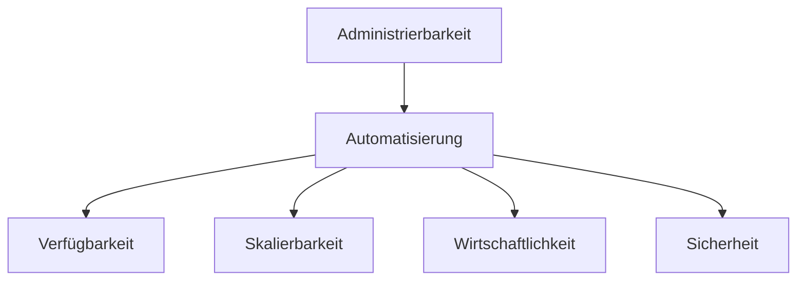

# Administrierbarkeit

## Vergleich verrschiedenen Automatierungslösungen

|                                           | Image                             | Skripte                                             | Orchestrierungstools                | Docker                                                | NixOS                                | NixOS+Flake                  |
|-------------------------------------------|-----------------------------------|-----------------------------------------------------|-------------------------------------|-------------------------------------------------------|--------------------------------------|------------------------------|
| Konfigurationsanpassung                   | Imperativ + neues Image erstellen | Variablen/Skript anpassen + ausführen               | Playbook anpassen + ausführen       | Dockerfile anpassen + (re)build                       | configuration.nix anpassen + rebuild | flake.nix anpassen + rebuild |
| Wiederherstellung möglich                 | **ja**                            | **ja**                                              | **ja**                              | **ja**                                                | **ja**                               | **ja**                       |
| Wiederherstellung+Updates                 | in separatem Schritt              | **ja**                                              | **ja**                              | **ja** (Updateschritt oder Rebuild)                   | **ja** differenziell                 | **ja** differenziell         |
| Änderungen können per Versionskontrolle verwaltet werden -> Changemanagement | (nein)                              | **ja**                                              | **ja**                              | **ja**                                                | **ja**                               | **ja**                       |
| Inkrementelle/Differenzielle Änderungen   | nein                              | **ja**                                              | **ja**                              | **ja**                                                | **ja**                               | **ja**                       |
| Imperativ/Deklarativ                      | (Imperativ)                       | Imperativ                                           | **(Deklarativ)**                    | **(Deklarativ)**(basiert auf Imperativen Anweisungen) | **Deklarativ**                       | **Deklarativ**               |
| Idempotente Änderungen                    | nein                              | aufwändig/fehleranfällig                            | **(ja)** (aufwändig/fehleranfällig) | **ja**                                                | **ja**                               | **ja**                       |
| Kombinierbarkeit mehrerer Konfigurationen | nein                              | (ja, aber fehleranfällig)                           | **(ja)**                            | (ja, **Baum** von Konfigurationen)                    | **ja**                               | **ja**                       |
| sauberes Deinstallieren                  | nein (nur durch vollständige Wiederherstellung)                              | aufwändig/fehleranfällig                            | (fehleranfällig)                    | **ja**                                                | **ja**                               | **ja**                       |
| Reproduzierbarkeit                        | nur auf Stand vorhandener Images  | nein (sehr schwer+fehleranfällig zu implementieren) | (nein)                              | schwer Seiteneffekte zu vermeiden                     | (**ja**) wenn Inputs gelockt sind    | **ja**                       |
