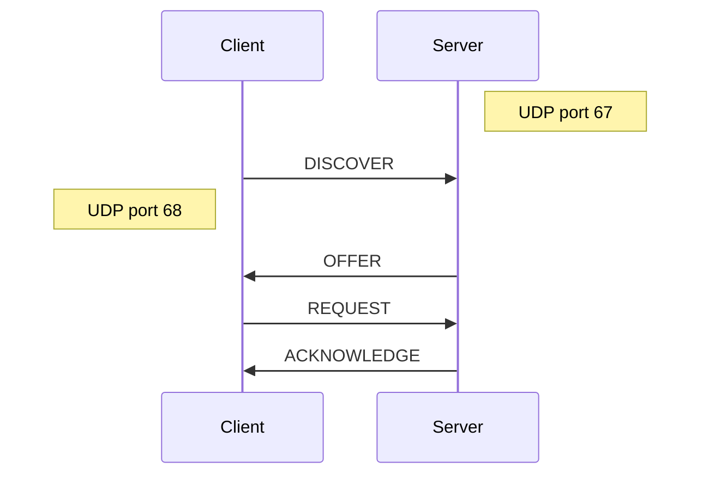
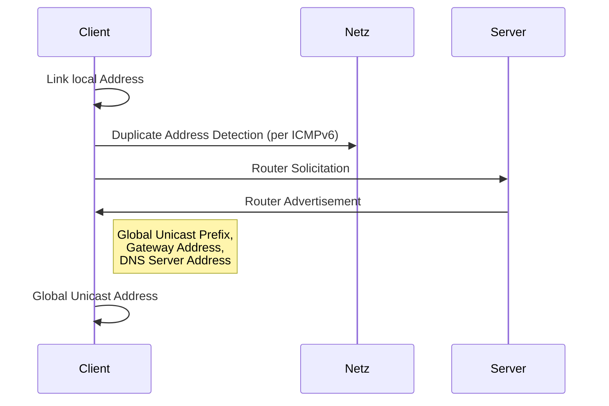

# DHCP
*RFC 2131*, Weiterentwicklung von *BOOTP*

## 4-Way-Handshake

## 3 Adressvergabeverfahren bei DHCP

### Manuell (Static Allocation)
* basierend auf MAC

### Automatisch (Automatic Allocaton)
* reserviert IP für MAC bei erster Vergabe

### Dynamisch (Dynamic Allocation)
* IP wird für **Lease-Time** vergeben

* nach **Renewal-Time** fragt Client den DHCP-Server per Unicast um Erneuerung de Lease-Time
* nach **Rebind-Time** falls keine Antwort auf Renewal: Broadcast um Lease von einem anderen DHCP-Server erneuert zu bekommen
* wenn Lease-Time abgelaufen: erneutes DHCP-Discover nötig

## DHCP-Relay
* erlaubt DHCP über Router hinweg
* im Relay wird Adresse des DHCP-Servers konfiguriert
* DHCP-Server benötigt separate Adress-Pools für jedes Subsetz

## Ausfallsicherheit
* 2 Varianten

### Active-Passive-Failover
* Active-DHCP-Server synchronisiert seinen Status mit Passive-DHCP-Servern
* Bei Ausfall übernimmt ein Passive

### Load-Balancing
* Scope (Adressbereich) wird aufgeteilt: Jeder Server ist für einen teil des Scopes Active
* Bei Ausfall übernimmt ein Passive den Scope des ausgefallenen Servers

## SLAAC (DHCPv6)
„Stateless Address Auto Configuration“

*RFC 4862 + RFC 8106*

