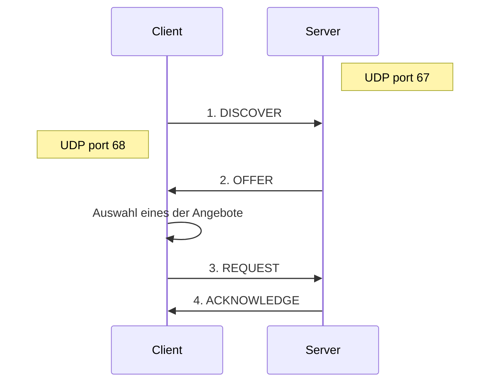
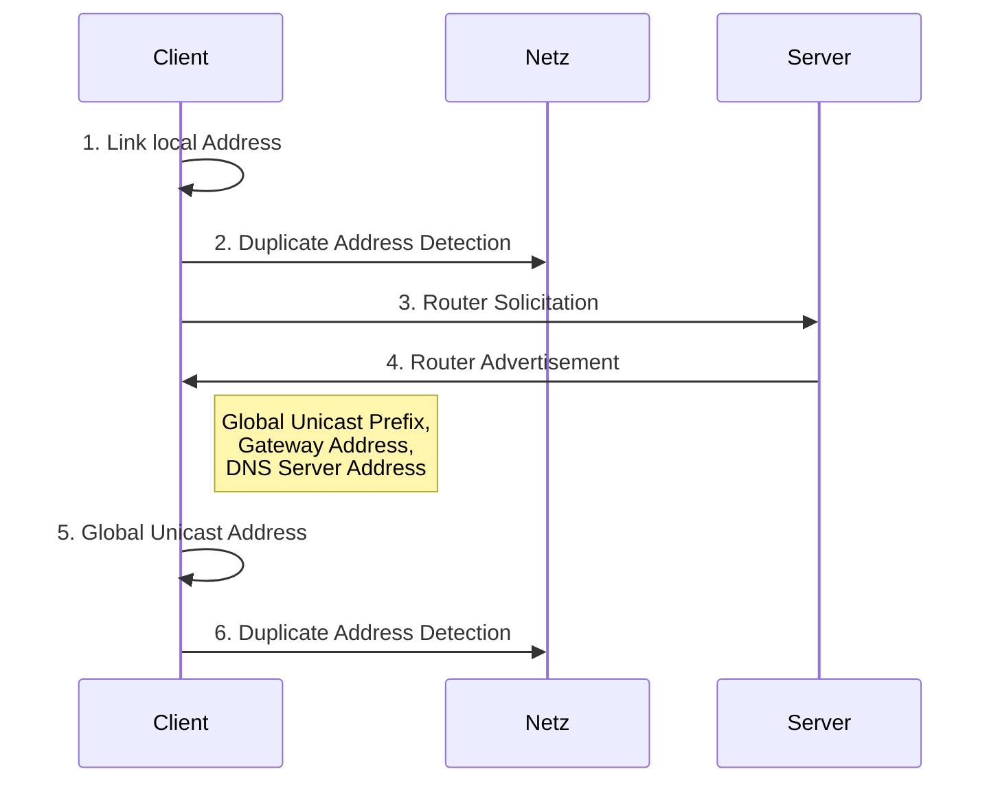

# [DHCP](https://de.wikipedia.org/wiki/Dynamic_Host_Configuration_Protocol)
**D**ynamic **H**ost **C**onfiguration **P**rotocol

*RFC 2131*, Weiterentwicklung von *BOOTP*

> **💬❗** Wofür wird DHCP benötigt?
>
> Ermöglicht die **Zuweisung der Netzwerkkonfiguration** an Clients durch einen Server
> * IP-Adresse, Netzmaske
> * Default Gateway
> * Name Server
> * …


<!-- toc -->


## „4-Way-Handshake“

([Initiale Adresszuweisung](https://de.wikipedia.org/wiki/Dynamic_Host_Configuration_Protocol#Initiale_Adresszuweisung_(Lease/Vergabe))) / „DORA“

> [**💬**](https://de.wikipedia.org/wiki/Dynamic_Host_Configuration_Protocol#Initiale_Adresszuweisung_(Lease/Vergabe))
> Wie bekommt ein neues Gerät im Netzwerk seine Konfiguration (vom DHCP-Server)?
>
> [**❓❗**](https://de.wikipedia.org/wiki/Dynamic_Host_Configuration_Protocol#DHCP-Nachrichten)
> Welche DHCP-Nachrichten werden dafür in welcher Reihenfolge versendet?
>
> [**❓❗**](# "per Broadcast") Wie finden Clients im Netzwerk den/die DHCP-Server?



1. **DISCOVER**
* UDP Broadcast an 255.255.255.255:67 (von Absenderadresse 0.0.0.0:68)

2. **OFFER**
* Server in der Broadcastdomain schlagen dem Client eine IP vor

4. **REQUEST**
* Client wählt einen der Server aus, der eine DHCPOFFER gesendet hat und „beantragt“ die vorgeschlagene IP

4. **ACK**NOWLEDGE
* Server bestätigt Zuteilung und übermittelt zusätzliche Konfigurationsdaten


> **💻** Demo:
> ```sh
> ## Vorhandene Leases löschen
> ## (damit wir die initiale Adresszuweisung beobachten können)
> sudo rm /var/lib/dhcpcd/*.lease
>
> ## DHCP-Pakete beobachten
> sudo tcpdump -n port bootps -v | grep --color DHCP
>
> ## Mehr Details über den Inhalt des ACKNOWLEDGE
> sudo tcpdump -n port bootps -v | grep --color ACK -A 10
> ```


## Adressvergabeverfahren bei DHCP

> [**❓❗**](https://de.wikipedia.org/wiki/Dynamic_Host_Configuration_Protocol#Der_DHCP-Server)
> Welche 3 Betriebsmodi (Adressvergabeverfahren) von DHCP gibt es?
>
> * Wie funktionieren sie?
>
> * Welche Vor- und Nachteile haben sie jeweils?
>
> * **💬** Für welche Zwecke werden sie jeweils eingesetzt?

### [Manuelle/Statische Zuordnung (Static Allocation)](https://de.wikipedia.org/wiki/Dynamic_Host_Configuration_Protocol#Statische_Zuordnung)
* basierend auf MAC
* nützlich, wenn Server eine Adresse per DHCP zugeteilt bekommen sollen

### [Automatisch (Automatic Allocaton)](https://de.wikipedia.org/wiki/Dynamic_Host_Configuration_Protocol#Automatische_Zuordnung)
* reserviert IP für MAC bei erster Vergabe
* Nachteil: keine neuen Clients möglich, wenn einmal gesamter Adressbereich vergeben

### [Dynamisch (Dynamic Allocation)](https://de.wikipedia.org/wiki/Dynamic_Host_Configuration_Protocol#Dynamische_Zuordnung)
* IP wird für **Lease-Time** („Leihdauer“) vergeben

* nach **Renewal-Time** fragt Client den DHCP-Server per Unicast um Erneuerung der Lease-Time
* nach **Rebind-Time** falls keine Antwort auf Renewal: Broadcast um Lease von einem anderen DHCP-Server erneuert zu bekommen
* wenn Lease-Time abgelaufen: erneutes DHCP-Discover nötig


## [DHCP-Relay](https://de.wikipedia.org/wiki/Dynamic_Host_Configuration_Protocol#DHCP-Relay)

> [**❓❗**](https://de.wikipedia.org/wiki/Dynamic_Host_Configuration_Protocol#DHCP-Relay)
> Was ist ein DHCP-Relay? Wofür wird es benötigt? Wie funktioniert es?

* erlaubt DHCP über Router hinweg
* im Relay wird Adresse des DHCP-Servers konfiguriert
* DHCP-Server benötigt separate Adress-Pools für jedes Subnetz


## Ausfallsicherheit

> **❓❗** Wie können Verfügbarkeit und Skallierbarkeit erhöht werden?

### Active-Passive-Failover
* Active-DHCP-Server synchronisiert seinen Status mit Passive-DHCP-Servern
* Bei Ausfall übernimmt ein Passive

### Load-Balancing
* Scope (Adressbereich) wird aufgeteilt: Jeder Server ist für einen teil des Scopes Active
* Bei Ausfall übernimmt ein Passive den Scope des ausgefallenen Servers


## [Sicherheit](https://de.wikipedia.org/wiki/Dynamic_Host_Configuration_Protocol#Sicherheit)

> [**💬**](https://de.wikipedia.org/wiki/Dynamic_Host_Configuration_Protocol#Sicherheit)
Diskutieren Sie die Sicherheit von DHCP im Bezug auf
> * Verfügbarkeit
> * Integrität
> * Vertraulichkeit
> * Anonymität
>
> Welche Gefahren gehen jeweils aus von
> * Server
> * Clients
> * Dritten
> 
> Wie kann man sich schützen? Welche Grenzen haben diese Maßnahmen?

* [DHCP Starvation Attack](https://de.wikipedia.org/wiki/DHCP_Starvation_Attack)
  * [Denial-of-Service-Angriff (DoS)](https://de.wikipedia.org/wiki/Denial_of_Service)
* [Rogue DHCP](https://de.wikipedia.org/wiki/Rogue_DHCP)
  * [Spoofing](https://de.wikipedia.org/wiki/Spoofing)
  * [Man-in-the-Middle-Angriff (MITM)](https://de.wikipedia.org/wiki/Man-in-the-Middle-Angriff)

### Maßnahmen
* [DHCP-Snooping](https://de.wikipedia.org/wiki/DHCP-Snooping)
* [Authentifizierung per IEEE 802.1X](https://de.wikipedia.org/wiki/IEEE_802.1X)
* [Security Awareness => **Un**sicherheitsbewustsein](https://de.wikipedia.org/wiki/Security_Awareness)


## [SLAAC](https://de.wikipedia.org/wiki/IPv6#Autokonfiguration) und [DHCPv6](https://de.wikipedia.org/wiki/DHCPv6)
„**S**tate**l**ess **A**ddress **A**uto **C**onfiguration“

*RFC 4862 + RFC 8106*

> [**💬**](https://de.wikipedia.org/wiki/IPv6)
> Was wissen wir zu IPv6?

> Wiederholung: IPv6-Subnetze
>
> **📝❗** FiSi AP2 Analyse Sommer 2024 Aufgabe 2e


> [**❓❗**](https://de.wikipedia.org/wiki/IPv6#Link-Local-Unicast-Adressen)
> Was sind Link-Local-Adressen?

> [**❓❗**](https://de.wikipedia.org/wiki/Neighbor_Discovery_Protocol#Router_Advertisement_%E2%80%93_Type_134)
> Was ist ein Router Advertisement?

> **💬** Warum wird SLAAC als „Stateless“ bezeichnet?
>
> * Welche Vor- und Nachteile bringt das mit sich?



1. Client generiert eine [Link-Local-Adresse](https://de.wikipedia.org/wiki/IPv6#Link-Local-Unicast-Adressen) (fe80::/64 z.B. aus der MAC)

2. Client prüft per [**N**eighbor **D**iscovery **P**rotocol](https://de.wikipedia.org/wiki/Neighbor_Discovery_Protocol#Erkennung_doppelter_Adressen) (ICMPv6), dass niemand anderes im Netz die gleiche Adresse nutzt

3. Client fragt mit [Router-Solicitation-Nachricht](https://de.wikipedia.org/wiki/Neighbor_Discovery_Protocol#Router-_und_Pr%C3%A4fix-Ermittlung) nach Routern

4. Router antworten mit **[Router Advertisement](https://de.wikipedia.org/wiki/Neighbor_Discovery_Protocol#Router_Advertisement_%E2%80%93_Type_134)**
* beinhaltet **Präfix**, innerhalb dessen er Adressen anbietet

5. Client generiert Globale Adresse mit Präfix des Routers (und z.B. MAC oder Zufall)

6. Client prüft per NDP, dass niemand anderes im Netz die gleiche Adresse nutzt

> **💻** Welche MAC-,IPv4-,IPv6-Adressen haben wir?
> * Welche der Adressen sind Link-Local und welche Global?
> * Wie dauerhaft sind die Adressen?
> * Wie wurden die Adressen konfiguriert/bezogen/generiert?
>
> ```sh
> ip a | grep --color -e state -e ether -e inet
> ```


### [DHCPv6](https://de.wikipedia.org/wiki/DHCPv6)

> [**💬**]((https://de.wikipedia.org/wiki/IPv6#Verh%C3%A4ltnis_von_Autokonfiguration_zu_DHCPv6) "DHCPv6 oder NDP-Erweiterungen werden benötigt um zusätzliche Konfigurationsdaten an Clients zu übertragen") In welchem Verhältnis stehen [SLAAC und DHCPv6](https://de.wikipedia.org/wiki/IPv6#Verh%C3%A4ltnis_von_Autokonfiguration_zu_DHCPv6)?
>
> **📝❗** FiSi AP2 Analyse Sommer 2024 Aufgabe 1


> **💬** Welche Vor-/Nachteile haben die unterschiedlichen Adressvergabeverfahren?

> **📝❗** FiSi AP2 Analyse Sommer 2022 Aufgabe 1
