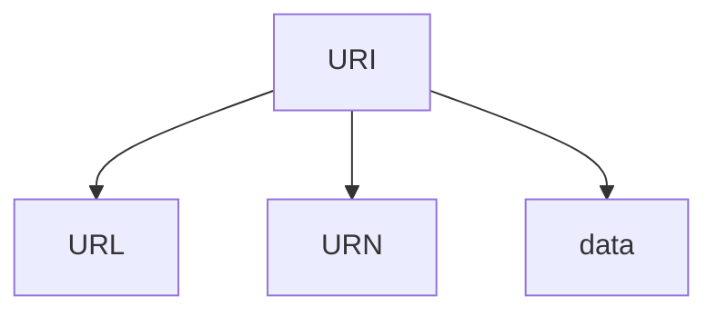
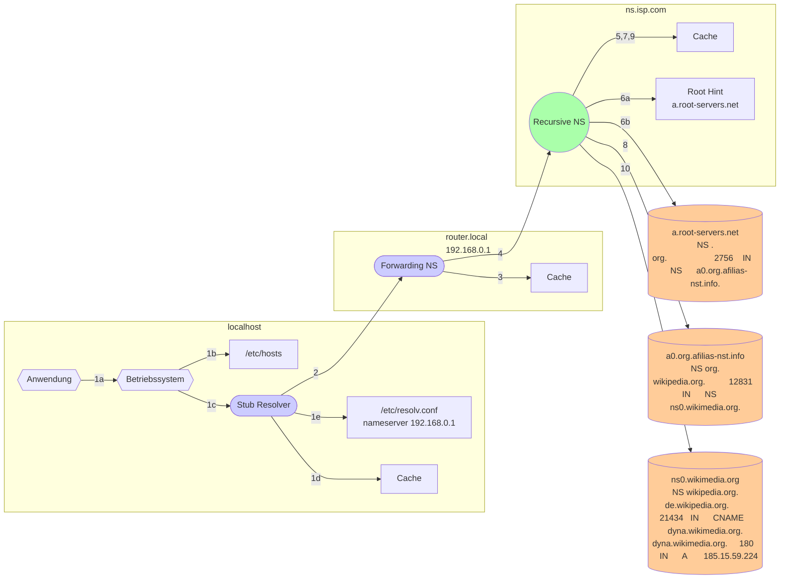

# DNS
**D**omain **N**ame **S**ystem

> **💬❗** Was ist DNS?
> * Wofür wird es benötigt?
> * Wie funktioniert es?

* Verzeichnisdienst
  * Client-/Server-Architektur
  * hiearchisch, verteilter
* „Telefonbuch“ des Internets
* insbesondere für Auflösung von Domainnamen zu IP-Adressen
  * …und andere Informationen begrenzter Datenmenge…
    * die dezentral bereitgestellt werden
    * die gecached werden dürfen

* ~~ersetzt~~ ergänzt `/etc/hosts` (bzw. `C:\Windows\System32\drivers\etc\hosts`)


> **📝❗** FiSi AP2 Analyse Sommer 2023 Aufgabe 4


> **📝❗** FiSi AP2 Analyse Winter 2021 Aufgabe 4b-c


## Inhaltsverzeichnis
<!-- toc -->


## URI, URL, Domänennamen, Zonen

### [URI](https://de.wikipedia.org/wiki/Uniform_Resource_Identifier)
**U**niform (Universal) **R**esource **I**dentifier

Werden insbesondere im WWW für Hyperlinks verwendet

> **❓❗** Was sind URIs?

URIs sind einheitlich [aufgebaut](https://de.wikipedia.org/wiki/Uniform_Resource_Identifier#Aufbau):
```
URI = scheme ":" hier-part [ "?" query ] [ "#" fragment ]
```
(RFC 3986)

### [URL, URN](https://de.wikipedia.org/wiki/Uniform_Resource_Identifier#Unterarten)


[**U**niform **R**esource **L**ocator](https://de.wikipedia.org/wiki/Uniform_Resource_Locator)
identifizieren Ressourcen mittels Adresse
* Schema entspricht dem „primären Zugriffsmechanismus“ z.B. `http`, `https`, `ftp`, `file`, `mailto`, `tel`
* z.B. `https://de.wikipedia.org/wiki/Uniform_Resource_Locator`, `git://github.com/johannesloetzsch/LF10b.git`

[**U**niform **R**esource **N**ame](https://de.wikipedia.org/wiki/Uniform_Resource_Name)
identifiziert inhaltsgleiche Ressourcen anhand eines dauerhaft gültigen, <ins>eindeutigen</ins> Namens
* Schema *sollte* „urn“ sein
* Namensräume werden von [IANA](https://de.wikipedia.org/wiki/Internet_Assigned_Numbers_Authority) vergeben
* z.B. urn:ISBN:978-3-14-220108-5

[**Data**-`URLs`](https://de.wikipedia.org/wiki/Data-URL)
identifizierten Ressourcen direkt über ihren Inhalt
* müssen die Kodierung benennen
* z.B. `data:image/png;base64,iVBORw0KGgoAAAANSUhEUgAAAAoAAAAKCAYAAACNMs+9AAAAXUlEQVQY073MvQ2CUADE8R90tOzgFkzgMg7gLs7BCDYmhD0sTV7F2Vi8EF5nuOpyH3/+rW4fhMvPDh3r4Stcwxxe4dbEh3co4ROedddXowmlyrYwtoj3sIRHc3S+vgySGhd7StmKAAAAAElFTkSuQmCC`


### FQDN
**F**ully **Q**ualified **D**omain **N**ame
* werden im `hier-part` von URIs verwendet
* enden auf einen Punkt (der aber oft weggelassen wird)


### [DNS-Zonen](https://de.wikipedia.org/wiki/Zone_(DNS))
Teil des Domänenbaums, für den ein Nameserver zuständig ist


#### [Root-Server](https://de.wikipedia.org/wiki/Root-Nameserver), [Root Hint](https://www.iana.org/domains/root/servers)


## Arten von Nameservern
> **❓❗** Wie funktionieren die unterschiedlichen Arten von DNS-Servern?
> * Warum ist es oft sinnvoll, einen vom ISP bereitgestellten Recursive Resolver und im eigenen Netz nur Forwarding Nameserver zu verwenden?  

Beispiel: Was ist alles nötig, um eine IP für `de.wikipedia.org.` zu erhalten?


```
6b: Welche Nameserver sind für die Zone `org.` zuständig?
    org.                    2756    IN      NS      a0.org.afilias-nst.info.

 8: Welche Nameserver sind für die Zone `wikipedia.org.` zuständig?
    wikipedia.org.          12831   IN      NS      ns0.wikimedia.org.

10: Unter welcher IP ist der Host `de.wikipedia.org.` erreichbar?
    de.wikipedia.org.       21434   IN      CNAME   dyna.wikimedia.org.
    dyna.wikimedia.org.     180     IN      A       185.15.59.224
```

### Authoritative
  * Zuständig für eine Zone
  * (Hoffentlich) unter Kontrolle des Domaininhabers

### Recursive
  * Resolved Anfragen rekursiv (Schrittweise vom Root-Server bis zur abgefragten Subdomain)
    * fragt für alle Zonen die jeweiligen Authoritativen Nameserver
  * Wird von ISPs bereitgestellt. Kann im eigenen Netz betrieben werden.

### Forwarding (Caching, Stub-Resolver)
  * Macht selbst keine rekursive Namensauflösung
  * Antworted aus dem Cache wenn Eintrag vorhanden und nicht älter als TTL
  * Wenn Eintrag nicht im Cache vorhanden: Fragt anderen Recursive (oder Forwarding) NS
  * Üblicherweise von Routern und Betriebsystemen bereitgestellt.


> **❓❗** Was muss beachtet werden, wenn lokale Server mittels DNS genutzt werden?

Die Zonen von öffentlichen Domains sind über recursive Abfrage ausgehend von den Root-Servern erreichbar.
Für lokale Netze können Authoritative Nameserver betrieben werden, die nicht öffentlich erreichbar sind. Damit Clients diese nutzen können, müssen diese die Nutzung des lokalen DNS-Servers konfigurieren.
> **📝❗** FiSi AP2 Analyse Sommer 2024 Aufgabe 2b


## [Resource Records](https://de.wikipedia.org/wiki/Resource_Record) und [RR-Typen](https://de.wikipedia.org/wiki/Resource_Record#RR-Typen)
Einträge (Zeilen) von Zonendateien

> [**❓❗**](https://de.wikipedia.org/wiki/Resource_Record#RR-Typen)
> Für welche Zwecke werden die folgenden RR-Typen benutzt?

Aufbau und Beispiele:

| name            | ttl (Sekunden) | class   | type   | rdata |
| ------------------------ | ----- | ------- | ------ | ------- |
| example.com.             | 3600  | IN      | A      | 172.30.0.7 |
| example.com.             | 3600  | IN      | AAAA   | 2600:1408:ec00:36::1736:7f24 |
| 7.0.30.172.in-addr.arpa. |       |         | PTR    | example.com. |
| www.example.com.         |       | IN      | CNAME  | example.com |
| example.org.             |       | IN      | DNAME  | example.com. |
| example.com.             |       |         | NS     | nameserver.example.com. |
| @                        | 3600  | IN      | SOA    | master.example.com. hostmaster.example.com. ( 2014031700 3600 1800 604800 600 ) |
| example.net.             |       | IN      | DNSKEY | ( 257 3 1 AQOW4333ZLdOHLRk+3Xe6RAaCQAOMhAVJu2Txqmk1Kyc13h69/wh1zhDk2jjqxsN6dVAFi16CUoynd7/EfaXdcjL ) |
| nsf.example.org.         |       |         | RRSIG  | A 1 3 1000 20060616062444 ( 20060517062444 9927 example.org.mMBIXxXU6buN53GWHTPpwEbse4aR2gNI8rgsg9/x1We23K3gkO5DBjFdty27Fj4FMbQzg0uBuv9aFcPaMyILJg== ) |
| filiale1.example.org.    |       |         | DS     | 52037 1 1 378929E92D7DA04267EE87E802D75C5CA1B5D280 |
| whatever.example.com.    | 3600  | IN      | TXT    | "Hello World" |
| _ldap._tcp.example.com.  | 3600  | IN      | SRV    | 10 0 389 ldap01.example.com. |
| example.com.             | 1800  | IN      | MX     | mailserver.example.com. |
| example.com.             | 3600  | IN      | SPF    | "v=spf1 mx -all" |
| mail._domainkey.example.com | 6000 | IN | TXT | v=DKIM1; p=76E629F05F70 9EF665853333 EEC3F5ADE69A 2362BECE4065 8267AB2FC3CB 6CBE	|

> **💻❗** Wo ist auf Unix-Servern konfiguriert, wie die Namensauflösung stattfinden soll?
> ```sh
> cat /etc/resolv.conf /etc/hosts
> ```

> **💻❗** Wie kann man zum debuggen die IP-Adresse(n) zu einem Domainnamen auflösen?
> ```sh
> dig afbb.de
> ```
>
> [`nslookup`](https://de.wikipedia.org/wiki/Nslookup), [`dig`, Alternativen](https://en.wikipedia.org/wiki/Dig_(command)#See_also)
>
> **📝❗** FiSi AP2 Analyse Sommer 2024 Aufgabe 3ab

> **💻** Wie können für eine Domain alle Records recursiv resolved werden?
> ```sh
> dig any afbb.de +trace
> ```


## Sicherheit

> [**💬❗**](https://de.wikipedia.org/wiki/Domain_Name_System#Sicherheit)
Diskutieren Sie die Sicherheit von DNS im Bezug auf
> * Verfügbarkeit, Zensurresistenz
> * Integrität, Authentizität
> * Vertraulichkeit, Anonymität
>
> Welche Gefahren gehen jeweils aus von
> * DNS-Server
> * Clients
> * ISP
> * Dritten
>   * Innerhalb der gleichen Broadcastdomain
>   * Außerhalb des eigenen Netzes
> 
> Wie kann man sich schützen? Welche Grenzen haben diese Maßnahmen?


### [DNS-Spoofing](https://de.wikipedia.org/wiki/DNS-Spoofing#DNS-Cache-Poisoning)
* Angreifer kann sich mittels DHCP-Spoofing als DNS-Server des Netzwerks ausgeben
* Angreifer kann sich mittels IP-Spoofing als DNS-Server ausgeben
  * Muss Antworten schneller als der korrekte DNS-Server ausliefern
    <br/> => kann mit DoS auf DNS-Server kombiniert werden

### [DNS-Cache-Poisoning](https://de.wikipedia.org/wiki/DNS-Cache-Poisoning)
* Angreifer kann DNS-Anfragen an Recursive oder Forwarding DNS-Server stellen und passende Antworten auf benötigte Rückfragen an nächsten Server selbst senden
* Wenn DNS-Server die Authentizität/Integrität der gefälschten Antworten nicht prüft:
  * DNS-Server schreibt die manipulierten Daten in den Cache und liefern diese bis zur TTL bei künftigen Anfragen aus


### Maßnahmen

#### [DNSSEC](https://de.wikipedia.org/wiki/Domain_Name_System_Security_Extensions#Funktionsweise)
**D**omain **N**ame **S**ystem **S**ecurity **E**xtensions

* **Authentizität** wird mittels digitalen Signaturen abgesichert
  * `DNSKEY` Resource Record beinhaltet öffentlichen Schlüssel der Zone
  * `RRSIG` Resource Record enthält Signatur für zugehörigen DNS-Record
  * Eine [**Chain of Trust**](https://de.wikipedia.org/wiki/Domain_Name_System_Security_Extensions#Chain_of_Trust) wird aufgebaut, indem in der Parent-Zone
    * ein `DS` (Delegation Signer) Resource Record mit dem Hash des Schlüssels der Zone abgelegt wird
    * die Parent-Zone selbst signiert wird
    * der oberste Schlüssel der Kette muss dem Client vorab bekannt sein [Vertrauensanker](https://de.wikipedia.org/wiki/Vertrauensanker)

> **❗** Vertraulichkeit ist bei DNSSEC nicht vorgesehen.
> DNS-Daten sind unverschlüsselt!


#### [DNS over TLS (DoT)](https://de.wikipedia.org/wiki/DNS_over_TLS)

#### [DNS over HTTPS (DoH)](https://de.wikipedia.org/wiki/DNS_over_HTTPS)
* Anwendung fragt DNS-Server direkt anstatt über das Betriebssystem


## Vertiefende Informationen

> **💡💬** [Pentaradio-Sendung zum Thema DNS <br/><br/>](https://c3d2.de/news/pentaradio24-20100525.html)
>
> <audio controls="controls" autoplay="autoplay">
>  <source src="http://ftp.c3d2.de/pentaradio/pentaradio-2010-05-25.ogg#t=2714" type="audio/ogg">
>  <source src="http://ftp.c3d2.de/pentaradio/pentaradio-2010-05-25.mp3#t=2714" type="audio/mpeg">
> </audio>

> **💡💬** Blog-Artikel zu [Anfriffsszenario auf DNSSEC](http://blog.johannesloetzsch.de/72/)

> **💻** [DNSSEC Workshop](https://www.schlittermann.de/doc/clt2010/)
