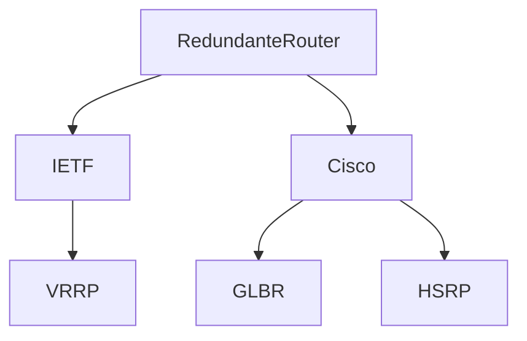

# Redundanz in Netzwerken

<!-- toc -->

> **❓❗** Welche Maßnahmen zur Bereitstellung von Redundanz in Netzwerken kennen Sie?

## [Link Aggregation](https://de.wikipedia.org/wiki/Link_Aggregation)
IEEE 802.3ad, IEEE 802.1AX

„Bonding“

=> Redundanz => Ausfallsicherheit

=> erhöhter Durchsatz

## [**F**irst **H**op **R**edundancy **P**rotocols (FHRP)](https://en.wikipedia.org/wiki/First-hop_redundancy_protocol)

> „Prüfungsvorbereitung Fachinformatiker Systemintegration“ 2.8.10. (Seite 104)

* verwenden Nachrichten um Status der Router auszutauschen
* verwenden virtuele MAC-Adresse
* verwenden virtuelle IP-Adresse

* erlauben LoadBalancing zwischen Routern (außer HSRP)
