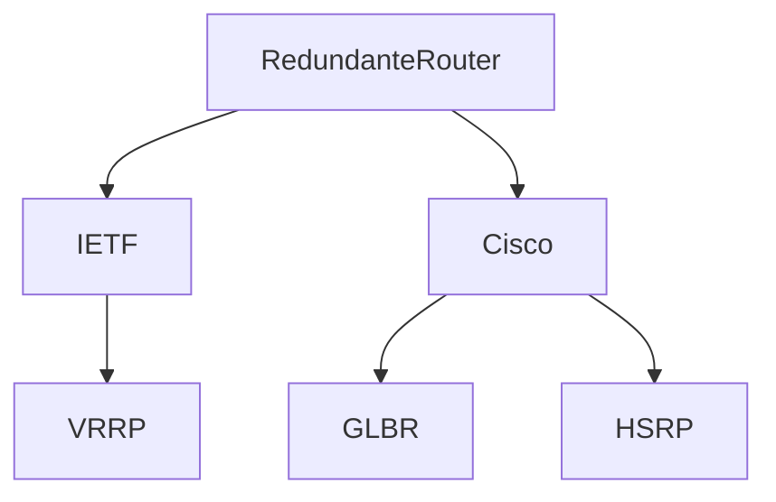

# Redundanz in Netzwerken

<!-- toc -->

> **❓❗** Welche Maßnahmen zur Bereitstellung von Redundanz in Netzwerken kennen Sie?


## [Spanning Tree Protocol](https://de.wikipedia.org/wiki/Spanning_Tree_Protocol)

## [Link Aggregation](https://de.wikipedia.org/wiki/Link_Aggregation)
IEEE 802.3ad, IEEE 802.1AX

„Bonding“

=> Redundanz => Ausfallsicherheit

=> erhöhter Durchsatz


## [**F**irst **H**op **R**edundancy **P**rotocols (FHRP)](https://en.wikipedia.org/wiki/First-hop_redundancy_protocol)

> „Prüfungsvorbereitung Fachinformatiker Systemintegration“ 2.8.10. (Seite 104)


```mermaid
flowchart TB
  RedundanteRouter --> IETF --> VRRP
  RedundanteRouter --> Cisco
  Cisco --> GLBR
  Cisco --> HSRP
```

* verwenden Nachrichten um Status der Router auszutauschen
* verwenden virtuele MAC-Adresse
* verwenden virtuelle IP-Adresse

* erlauben LoadBalancing zwischen Routern (außer HSRP)

## [Anycast](https://de.wikipedia.org/wiki/Anycast)

## [Round robin DNS](https://de.wikipedia.org/wiki/Lastverteilung_per_DNS)

## Load Balancer

Beispielkonfiguration eines [HAProxy](https://github.com/haproxy/haproxy):
```
frontend example_frontend
    bind *:80
    default_backend example_backend

backend example_backend
    balance roundrobin

    option httpchk GET /health
    http-check expect status 200

    server srv1 10.0.0.11:8080 check
    server srv2 10.0.0.12:8080 check
    server srv3 10.0.0.13:8080 check
```

Methoden zur Lastverteilung:
* Round Robin
* Least Connections
* IP-Hashing

> Beispiel: [Active/Active clustering von HAProxy](https://www.haproxy.com/documentation/haproxy-enterprise/administration/high-availability/active-active/)
> * mittels [DNS round-robin](https://www.haproxy.com/documentation/haproxy-enterprise/administration/high-availability/active-active/#configure-dns-round-robin)
> * mittels [VRRP](https://www.haproxy.com/documentation/haproxy-enterprise/administration/high-availability/active-active/#configure-vrrp)
> * mittels Anycast
