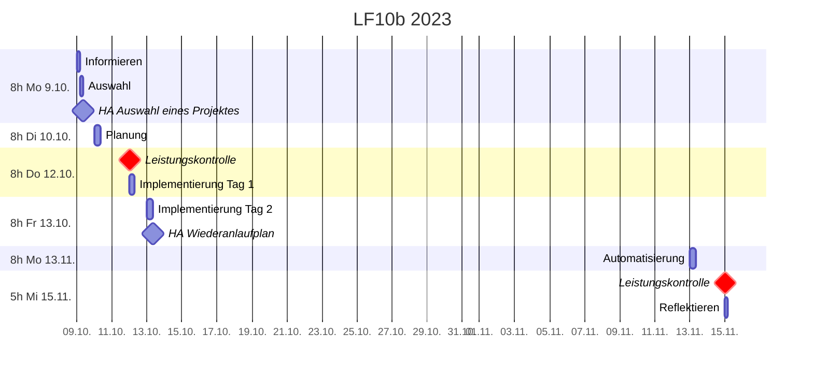

# Plan

## Zeitplan

## Leistungskontrollen
* Do 12.10. **doppelte Wertung**
  * [Verfügbarkeit](./verfuegbarkeit.md) (vollständig)
    * [Datensicherung](./datensicherung.md) (insbesondere SOL+Prüfungsaufgaben)
    * [Versionierung](./versionierung.md) [(einschließlich wichtigster Operationen)](https://johannesloetzsch.github.io/linux-praktikum/versionskontrolle.html)
    * [Monitoring (Ziele)](./monitoring.md)
* Mi 15.11.
  * Automatisierung
    * Administrierbarkeit
    * Skalierbarkeit
