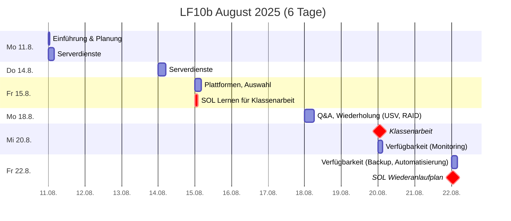
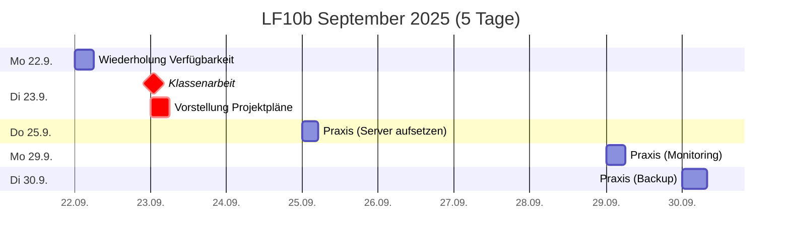
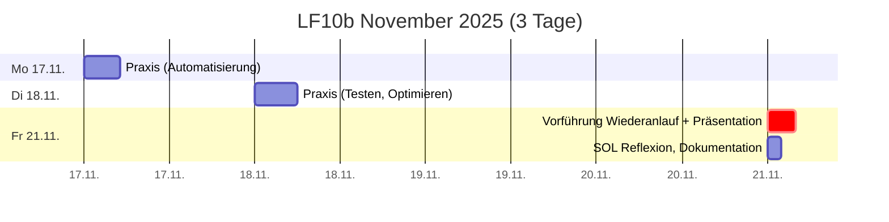

# Plan
80UE -> 2 doppelte + 3 einfache Noten

## Zeitplan

## Leistungsnachweise
* **Klassenarbeit Mi 20.8.2025** (doppelte Wertung, 90min, handschriftlich)
  * erlaubte Hilfsmittel: Fact sheet (1 A4-Blatt, einseitig beschrieben)
  * Inhalte
    * [Serverdienste](./serverdienste.md)
      * [DHCP](./dienste/dhcp.md)
      * [DNS](./dienste/dns.md)
      * [NTP](./dienste/ntp.md)
      * [LDAP](./dienste/ldap.md)
      * [Mail](./dienste/mail.md)
    * [Plattformen](./plattformen.md)
    *  *[Auswahl gemäß Kundenanforderungen](./auswahl.md)*
       * [Skalierbarkeit](./skalierbarkeit.md)
    * *([Verfügbarkeit](./verfuegbarkeit.md) ?)*
      * (*[RAID](./raid.md)*?)
      * (*[USV](./usv.md)*?)

* **Klassenarbeit Di 23.9.2025** (doppelte Wertung, 90min, handschriftlich)
  * erlaubte Hilfsmittel: Fact sheet (1 A4-Blatt, einseitig beschrieben)
  * Inhalte
    * [Verfügbarkeit](./verfuegbarkeit.md)
      * [RAID](./raid.md)
      * [USV](./usv.md)
      * [Datensicherung](./datensicherung.md)
      * [Monitoring](./monitoring.md)

* **Projektplan** (einfache Wertung)
  * Insbesondere Wiederanlaufplan (SOL vom Fr 22.8.)
  * Vortrag am **Di 23.9.**

* Projektpräsentation **Fr 21.11.2025**
  * **fachlicher Projekterfolg** (einfache Wertung)
    * Umsetzung der [zu optimierenden Ziele](./optimieren.md)
    * Demonstration Wiederanlauf, Einhaltung der RTO
  * **Mitarbeit** (einfache Wertung)
