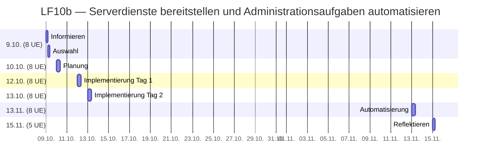

# Plan

## Zeitplan

```mermaid
gantt
 title LF10b — Serverdienste bereitstellen und Administrationsaufgaben automatisieren
 dateFormat YYYY-MM-DD
 axisFormat %d.%m.
 section  9.10. (8 UE)
  Informieren           :informieren, 2023-10-09, 4h
  Auswahl               :auswahl,after informieren, 4h
 section 10.10. (8 UE)
  Planung               :planung, 2023-10-10, 8h
 section 12.10. (8 UE)
  Implementierung Tag 1 :Implementierung, 2023-10-12, 8h
 section 13.10. (8 UE)
  Implementierung Tag 2 :Implementierung, 2023-10-13, 8h
 section 13.11. (8 UE)
  Automatisierung       :Automatisierung, 2023-11-13, 8h
 section 15.11. (5 UE)
  Reflektieren          :Reflektieren, 2023-11-15, 5h
```
