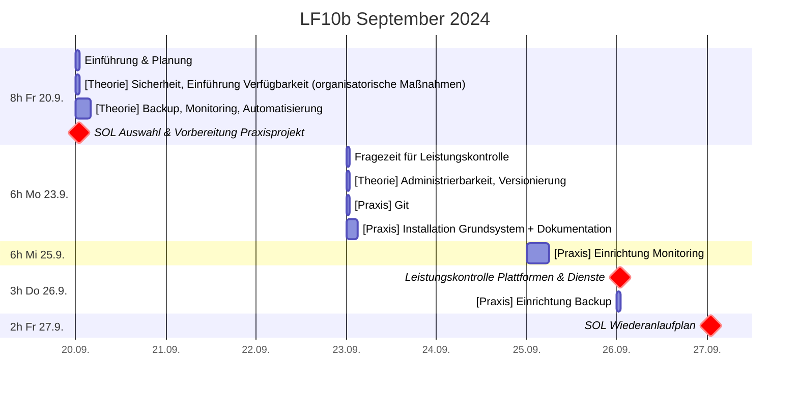
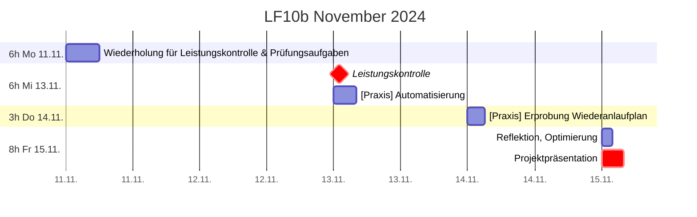

# Plan

## Zeitplan

## Leistungskontrolle
* Mi 13.11. **Klausur: doppelte Wertung, 90min, handschriftlich**
  * erlaubte Hilfsmittel
    * Notizen: 1 A4-Blatt, einseitig beschrieben
  * Inhalte
    * [Verfügbarkeit](./verfuegbarkeit.md)
      * [Datensicherung](./datensicherung.md)
      * [Monitoring](./monitoring.md)
    * [Versionierung (git)](./versionierung.md)
    * [Skalierbarkeit](./skalierbarkeit.md)
