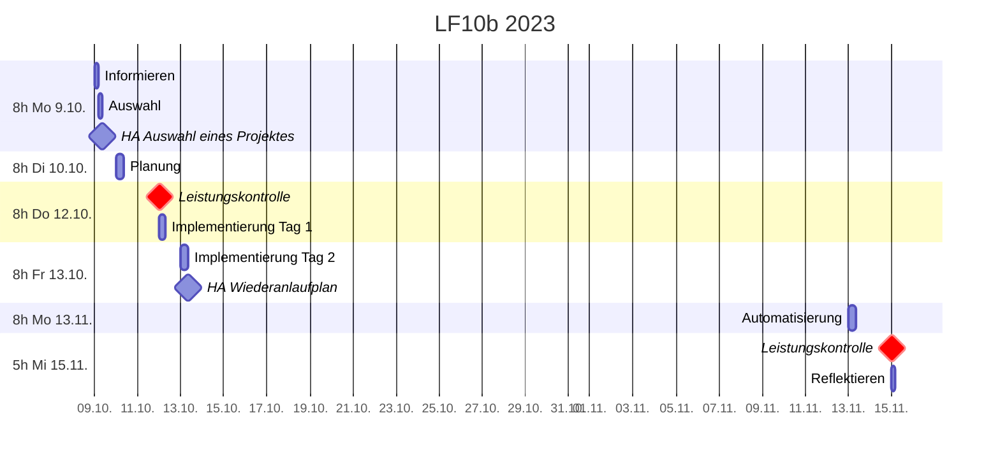

# Plan

## Zeitplan

## Leistungskontrollen
* Do 12.10. **Klausur: doppelte Wertung, 90min, handschriftlich**
  * Inhalte
    * [Verfügbarkeit](./verfuegbarkeit.md) (vollständig)
      * [Datensicherung](./datensicherung.md) (insbesondere SOL+Prüfungsaufgaben)
      * [Versionierung](./versionierung.md) [(einschließlich wichtigster Operationen)](https://johannesloetzsch.github.io/linux-praktikum/versionskontrolle.html)
      * [Monitoring (Ziele)](./monitoring.md)
  * erlaubte Hilfsmittel
    * Notizen: 1 A4-Blatt, einseitig beschrieben
    * Taschenrechner (nicht kommunikationsfähig!), aber sollte nicht nötig sein
* Mi 15.11.
  * Automatisierung
    * Administrierbarkeit
    * Skalierbarkeit

## Checkliste
### Mo 9.10. + Di 10.10.

> - [x] Allgemeine Infos
> - [x] Übersicht LF10b
> - [x] kurze Wiederholung: Serverdienste + Plattformen
> - [x] Ausführlich: **Verfügbarkeit**
> - [x] knappe Einordnung: andere Kundenanforderungen (Wirtschaftlichkeit, Sicherheit, Skalierbarkeit, Administrierbarkeit)
> - [x] Ausführlich: **Datensicherung**
> - [x] HA erklären: Auswahl eines Projektes
> - [x] Einführung: **Versionierung** (git)

> - [x] Zeit für Fragen/Wiederholung
> - [x] Ausführlich: **Monitoring**
> - [x] knapp: sonstige Kriterien für Konfigurationsplanung (Einrichtung, Aktualisierung -> Automatisierung)
> - [x] **Planung des eigenen Projektes** [(Vorlage)](./planen.md)
>   - [x] Informieren über Lösungen
> - optional:
>   - Klausurvorbereitung
>   - Beginn mit Implementierung/Integration

#### Do 12.10. + Fr 13.10.

> - [x] **Klausur**
> - [x] Grundsystem aufsetzen (+ dokumentieren)
> - [x] **Backup** aufsetzen

> - [x] **Monitoring** aufsetzen
> - [x] Erklären der Hausaufgabe: Wiederanlaufplan
> - [x] Überlegungen zu **Automatisierung**
> - optional:
>   - mit Hausaufgabe beginnen

#### Mo 13.11. + Mi 15.11.
> - [ ] Vergleich verrschiedenen **Automatierungslösungen**
> - [ ] Backup testen (zurückspielen)
> - [ ] Verbesserung der Automatisierung
> - [ ] Vorstellung der erreichten Lösungen
