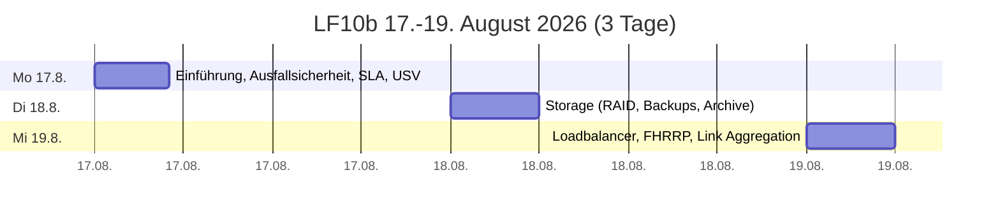
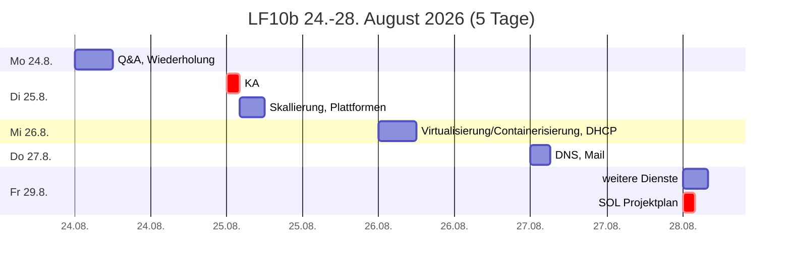
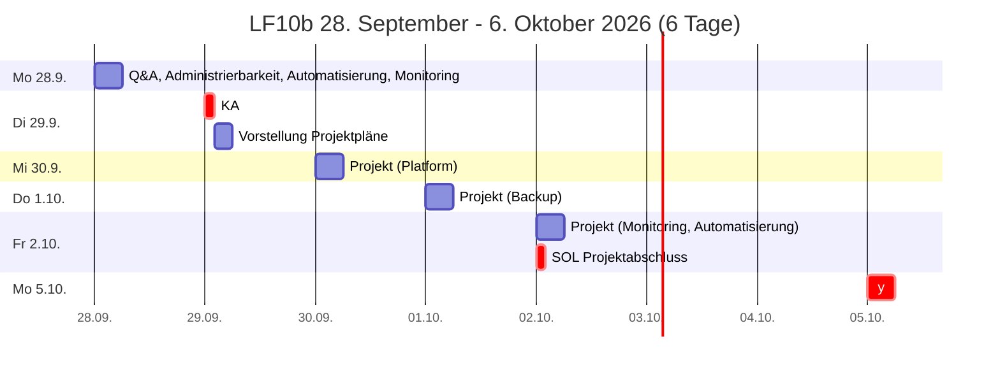

# Plan
80UE -> 2 doppelte + 3 einfache Noten

## Zeitplan

```mermaid
gantt
 title LF10b 17.-19. August 2026 (3 Tage)
 dateFormat YYYY-MM-DD
 axisFormat %d.%m.
 section Mo 17.8.
  Einführung, Ausfallsicherheit, SLA, USV   :2026-08-17, 5h
 section Di 18.8.
  Storage (RAID, Backups, Archive)  :2026-08-18, 6h
 section Mi 19.8.
  Loadbalancer, FHRRP, Link Aggregation  :2026-08-19, 6h
```

```mermaid
gantt
 title LF10b 24.-28. August 2026 (5 Tage)
 dateFormat YYYY-MM-DD
 axisFormat %d.%m.
 section Mo 24.8.
  Q&A, Wiederholung           :2026-08-24, 6h
 section Di 25.8.
  KA                          :crit, ka1, 2026-08-25, 2h
  Skallierung, Plattformen    :after ka1, 4h
 section Mi 26.8.
  Virtualisierung/Containerisierung, DHCP  :2026-08-26, 6h
 section Do 27.8.
  DNS, Mail                   :2026-08-27, 3h
 section Fr 29.8.
  weitere Dienste             :2026-08-28, 4h
  SOL Projektplan             :crit, 2026-08-28, 2h
```

```mermaid
gantt
 title LF10b 28. September - 6. Oktober 2026 (6 Tage)
 dateFormat YYYY-MM-DD
 axisFormat %d.%m.
 section Mo 28.9.
  Q&A, Administrierbarkeit, Automatisierung, Monitoring  :2026-09-28, 6h
 section Di 29.9.
  KA                          :crit, ka2, 2026-09-29, 2h
  Vorstellung Projektpläne    :after ka2, 4h
 section Mi 30.9.
  Projekt (Platform)          :2026-09-30, 6h
 section Do 1.10.
  Projekt (Backup)            :2026-10-01, 6h
 section Fr 2.10.
  Projekt (Monitoring, Automatisierung)  :2026-10-02, 6h
  SOL Projektabschluss        :crit, 2026-10-02, 2h
 section Mo 5.10.
  y                           :crit, 2026-10-05, 6h
```

## Leistungsnachweise

* **Klassenarbeit Di 25.8.2026** (doppelte Wertung, 90min, handschriftlich)
  * Inhalte
    * [**Verfügbarkeit**](./verfuegbarkeit.md): SLA, MTTF, MTBF, TOM
      * [Badewannenkurve](https://de.wikipedia.org/wiki/Badewannenkurve), Mix and Match
      * [USV](./usv.md): 3 Typen vergleichen
      * [**RAID**](./raid.md): Level vergleichen, Rechenaufgaben
      * [**Datensicherung**](./datensicherung.md): RTO, RPO, WORM, 3-2-1, Generationenprinzip, Strategien, Rechenaufgaben
      * Loadbalancer, FHRP, Link Aggregation
      <!--* [Monitoring](./monitoring.md): Komponenten, Metriken, SMART, [SNMP](./snmp.md)-->
    * [Auswahl gemäß Kundenanforderungen](./auswahl.md): Auswählen und Begründen im Bezug auf: [Wirtschaftlichkeit](./wirtschaftlichkeit.md), [Skalierbarkeit](./skalierbarkeit.md), [Administrierbarkeit](./administierbarkeit.md), Sicherheit
      * [Skalierbarkeit](./skalierbarkeit.md#kurz-und-knapp): scale up / scale out

* **Klassenarbeit Di 29.9.2026** (doppelte Wertung, 90min, handschriftlich)
  * Inhalte
    * [Plattformen](./plattformen.md)
      * [Cloud](./plattformen.md): Charakeristiken, Vor-/Nachteile, Service Models, Liefermodelle
      * [Virtualisierung](./virtualisierung.md): Hypervisor-Typen, Container-Arten
    * [Serverdienste](./serverdienste.md)
      * [DHCP](./dienste/dhcp.md): 4-Way-Handshake, Adressvergabeverfahren, Ausfallsicherheit, SLAAC
      * [DNS](./dienste/dns.md): URI, FQDN, Arten von Nameservern, RR-Typen, DNSSEC
      * [NTP](./dienste/ntp.md): Funktionsweise
      * [LDAP](./dienste/ldap.md): 4 AD Hauptkomponenten
      * [Mail](./dienste/mail.md): MUA/MTA/MDA, MX, SPF, DKIM, DMARK
      * [VoIP](./dienste/voip.md): Protokolle benennen

* **Projektplan** (einfache Wertung)
  * Insbesondere Wiederanlaufplan (SOL vom Fr 29.8.)
  * Vortrag am **Di 29.9.2026**

* Projektpräsentation **Fr 5.10.2026**
  * **fachlicher Projekterfolg** (einfache Wertung)
    * Umsetzung der [zu optimierenden Ziele](./optimieren.md)
    * Demonstration Wiederanlauf, Einhaltung der RTO
  * **Mitarbeit** (einfache Wertung)
