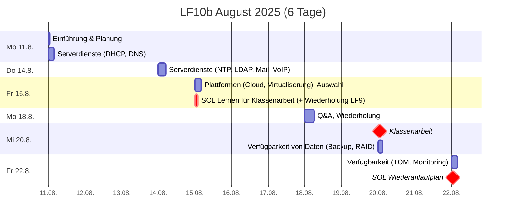
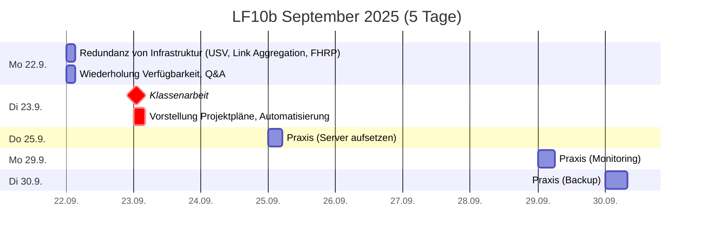

# Plan
80UE -> 2 doppelte + 3 einfache Noten

## Zeitplan

## Leistungsnachweise
* **Klassenarbeit Mi 20.8.2025** (doppelte Wertung, 90min, handschriftlich)
  * erlaubte Hilfsmittel: Fact sheet (1 A4-Blatt, einseitig beschrieben)
  * Inhalte
    * [Serverdienste](./serverdienste.md)
      * [DHCP](./dienste/dhcp.md): 4-Way-Handshake, Adressvergabeverfahren, Ausfallsicherheit, SLAAC
      * [DNS](./dienste/dns.md): URI, FQDN, Arten von Nameservern, RR-Typen, DNSSEC
      * [NTP](./dienste/ntp.md): Funktionsweise
      * [LDAP](./dienste/ldap.md): 4 AD Hauptkomponenten
      * [Mail](./dienste/mail.md): MUA/MTA/MDA, MX, SPF, DKIM, DMARK
      * [VoIP](./dienste/voip.md): Protokolle benennen
    * [Plattformen](./plattformen.md)
      * [Cloud](./plattformen.md): Charakeristiken, Vor-/Nachteile, Service Models, Liefermodelle
      * [Virtualisierung](./virtualisierung.md): Hypervisor-Typen, Container-Arten
    *  (*[Auswahl gemäß Kundenanforderungen](./auswahl.md)*)
       * [Skalierbarkeit](./skalierbarkeit.md#kurz-und-knapp): scale up / scale out
    * *([Verfügbarkeit](./verfuegbarkeit.md))*: Überblick Maßnahmen

* **Klassenarbeit Di 23.9.2025** (doppelte Wertung, 90min, handschriftlich)
  * erlaubte Hilfsmittel: Fact sheet (1 A4-Blatt, einseitig beschrieben)
  * Inhalte
    * [**Verfügbarkeit**](./verfuegbarkeit.md): MTTF, MTBF, TOM
      * [USV](./usv.md): 3 Typen vergleichen
      * [**RAID**](./raid.md): Level vergleichen, Rechenaufgaben
      * [**Datensicherung**](./datensicherung.md): RTO, RPO, WORM, 3-2-1, Generationenprinzip, Strategien, Rechenaufgaben
      * [Monitoring](./monitoring.md): Komponenten, Metriken, SMART, [SNMP](./snmp.md)
    *  [Auswahl gemäß Kundenanforderungen](./auswahl.md): Auswählen und Begründen im Bezug auf: [Wirtschaftlichkeit](./wirtschaftlichkeit.md), [Skalierbarkeit](./skalierbarkeit.md), [Administrierbarkeit](./administierbarkeit.md), Sicherheit

* **Projektplan** (einfache Wertung)
  * Insbesondere Wiederanlaufplan (SOL vom Fr 22.8.)
  * Vortrag am **Di 23.9.**

* Projektpräsentation **Fr 21.11.2025**
  * **fachlicher Projekterfolg** (einfache Wertung)
    * Umsetzung der [zu optimierenden Ziele](./optimieren.md)
    * Demonstration Wiederanlauf, Einhaltung der RTO
  * **Mitarbeit** (einfache Wertung)
