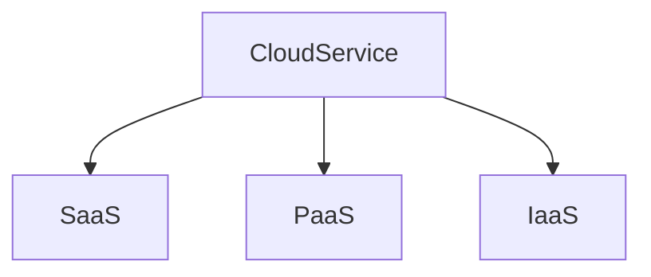

# Plattformen

> **💬❗** Welche Plattformen gibt es? Wie unterscheiden sie sich?

* Verschiedene Rechnerarchitekturen (RISC/CISC)
* Verschiedene Betriebssysteme
* On-Premises vs. Cloudanbieter

> **💬**
> Welche Kriterien für eine Auswahl gemäß Kundenanforderungen sollten bei der Entscheidung für eine Plattform berücksichtigt werden?

> **💬❗**
> Welche langfristigen Folgen kann eine Entscheidung für eine Plattform bedeuten?

## [Technische Schulden](https://de.wikipedia.org/wiki/Technische_Schulden) und [Vendor Lock-in](https://de.wikipedia.org/wiki/Lock-in-Effekt)

> **💬**
> Inwieweit sollten offene Standarts bei der Auswahl einer Plattform bzw. eines Anbieters berücksichtigt werden?

<!-- toc -->

## [Cloud](https://de.wikipedia.org/wiki/Cloud_Computing)

> **📝❗** FiSi AP2 Analyse Winter 2021 Aufgabe 1
> **📝❗** FiSi AP2 Analyse Winter 2022 Aufgabe 1a
> **📝❗** FiSi AP2 Analyse Winter 2023 Aufgabe 1a

### Charakeristiken von Cloud-Computing

> [**🇺🇸 💬**](https://csrc.nist.gov/pubs/sp/800/145/final)
> Welche [Cloud-Computing Charakteristiken](https://csrc.nist.gov/pubs/sp/800/145/final) wurden vom NIST definiert?

#### On-demand Self-service
=> Selbstbedienung

#### Broad Network Access
=> mit Standardmechanismen über das Netzwerk erreichbar

#### Resource Pooling
=> Ressourcen des Anbieters werden zusammengefasst und bedienen mehrere Nutzer nach dem [Mandantenprinzip](https://de.wikipedia.org/wiki/Mandantenf%C3%A4higkeit)

#### Rapid Elasticity
=> Leistung wird dynamisch bereitgestellt/freigegeben und kann bedarfsgerecht skalieren
=> Aus Nutzersicht scheinen die verfügbaren Ressourcen unbegrenzt

#### Measured Service
=> Genutzte Ressoucen werden gesteuert und überwacht. Die Bezahlung erfolgt nach dem Prinzip **pay-per-use**

### Service Models

#### [SaaS](https://de.wikipedia.org/wiki/Software_as_a_Service)
**S**oftware **a**s **a** **S**ervice

#### [PaaS](https://de.wikipedia.org/wiki/Platform_as_a_Service)
**P**latform **a**s **a** **S**ervice

z.B. „AWS Container Service“ „AWS Kubernetes Service“

#### [IaaS](https://de.wikipedia.org/wiki/Infrastructure_as_a_Service)
**I**nfrastructure **a**s **a** **S**ervice

z.B. virtuelle Server, „AWS Elastic Compute Cloud2“ (EC2)

> **💬** Welche Cloud-Plattformen/-Lösungen/-Produkte sollte man kennen?
>
> Auf welchen Standarts basieren sie und welche Alternativen gibt es?

### Liefermodelle

> **💬❗** Welche [Liefermodelle](https://de.wikipedia.org/wiki/Cloud_Computing#Liefermodelle) werden unterschieden?

#### Public Cloud
=> Was wir klassisch meinen, wenn wir von Cloud sprechen
#### Private Cloud
=> „Cloud-Umgebung“, die ausschließlich für eine Organisation oder ein Unternehmen betrieben wird
#### Hybrid Cloud, Community Cloud, Virtual Private Cloud, Multicloud, …

> **💡💬** Vortrag: [„Sollen wir in die Cloud gehen?“](http://ptrace.fefe.de/cloud/#1)

## [On-Premises](https://de.wikipedia.org/wiki/On-Premises)
=> „in den eigenen Räumlichkeiten“

### [Cluster](https://de.wikipedia.org/wiki/Rechnerverbund)
„Rechnerverbund“ / „Schwarm“ / „Farm“

Architektur aus vernetzten Servern („Knoten“), die zusammenwirken um einen gemeinsamen Dienst zu erbringen.

Werden üblicherweise eingesetzt um Kapazität (Compute + Storage) und Verfügbarkeit im benötigten Maß gewährleisten zu können.

Basieren auf dem Prinzip der [Horizontalen Skalierung (scale out)](https://de.wikipedia.org/wiki/Skalierbarkeit#Horizontale_Skalierung_(scale_out).)
