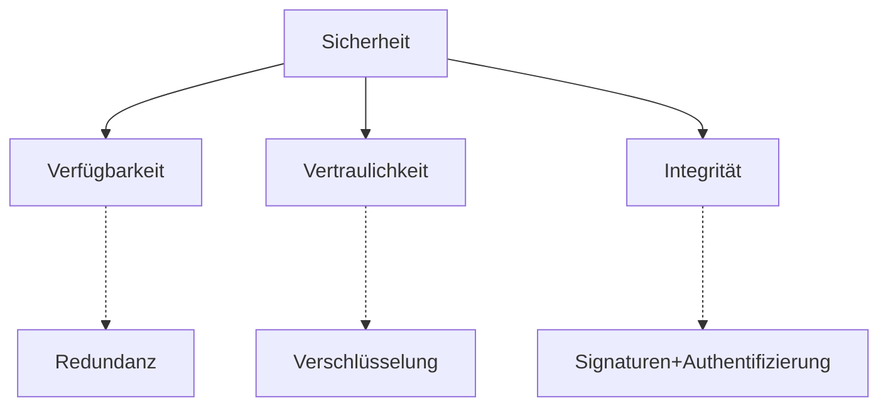
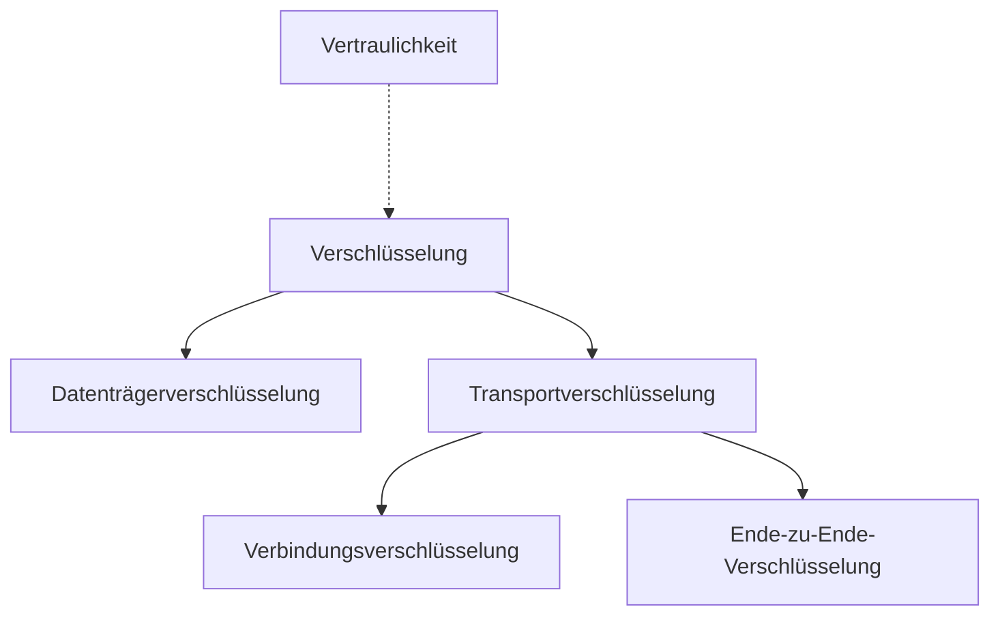
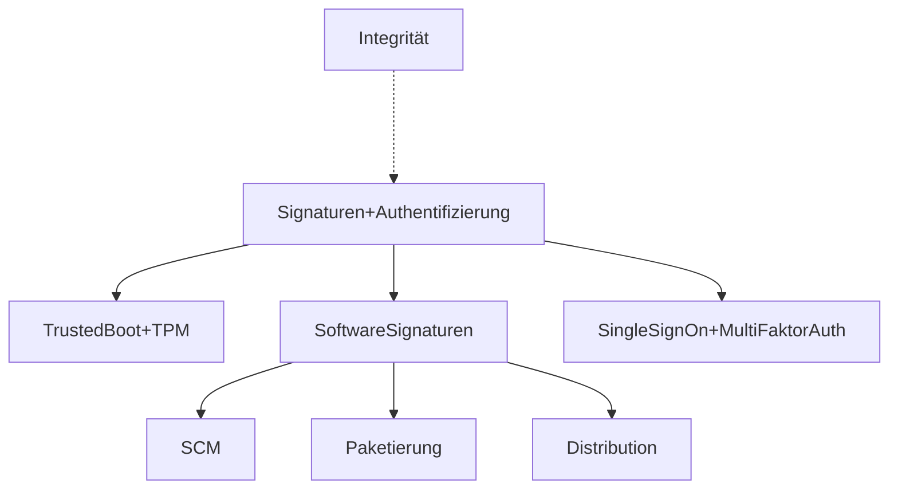

# Sicherheit

ErwartetungswertSchaden = ∑ WahrscheinlichkeitSchadenseintritt * SchadenshöheSchadensfall

## Schutzziele und Maßnahmen

```mermaid
flowchart TB
  Sicherheit --> Verfügbarkeit -..-> Redundanz
  Sicherheit --> Vertraulichkeit -..-> Verschlüsselung
  Sicherheit --> Integrität -..-> Signaturen+Authentifizierung
```

### Vertraulichkeit

```mermaid
flowchart TB
  Vertraulichkeit -..-> Verschlüsselung
  Verschlüsselung --> Datenträgerverschlüsselung
  Verschlüsselung --> Transportverschlüsselung
  Transportverschlüsselung --> Verbindungsverschlüsselung
  Transportverschlüsselung --> Ende-zu-Ende-Verschlüsselung
```

### Integrität

```mermaid
flowchart TB
  Integrität -..-> Signaturen+Authentifizierung
  Signaturen+Authentifizierung --> TrustedBoot+TPM
  Signaturen+Authentifizierung --> SoftwareSignaturen
  SoftwareSignaturen --> SCM
  SoftwareSignaturen --> Paketierung
  SoftwareSignaturen --> Distribution
  Signaturen+Authentifizierung --> SingleSignOn+MultiFaktorAuth
```
