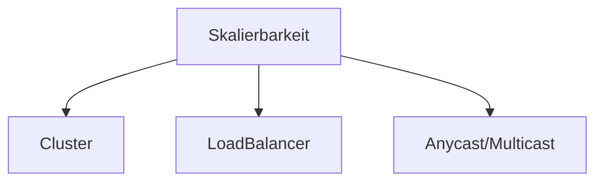

# Skalierbarkeit

> **❓❗** Welche Arten von Skalierbarkeit gibt es und in und welche davon möchten Sie in welchen Fällen nutzen?

> **📝❗** FiSi AP2 Konzeption Sommer 2023 Aufgabe 2b

## [**Horizontale Skalierung** (scale out) vs **Vertikale Skalierung (scale up)**](https://de.wikipedia.org/wiki/Skalierbarkeit#Vertikale_vs._horizontale_Skalierung:~:text=%5B3%5D-,Vertikale%20Skalierung%20(scale%20up),-%5BBearbeiten%20%7C)

=> Wenn „doppelt so viel“ benötigt wird, kostet das meist deutlich mehr als das zweifache
 (bei scale up)…

=> Warum nicht einfach „zweimal das einfache“ nutzen?
 => **scale out!** => [commercial off-the-shelf](https://de.wikipedia.org/wiki/Commercial_off-the-shelf)

<!-- toc -->

 an der Technischen Universität Chemnitz")

## Beispiele für Umsetzung von horizontaler Skalierungslösungen

## Einschränkung durch Kommunikation + SharedMemory

Grenzen der horizontale Skalierung:

* [**Verteilte Dateisysteme**](https://de.wikipedia.org/wiki/Verteiltes_Dateisystem)
* [Verteilte **Datenbankmanagementsysteme**](https://de.wikipedia.org/wiki/Verteiltes_Datenbankmanagementsystem)
* [**U**niform **M**emory **A**ccess](https://de.wikipedia.org/wiki/Uniform_Memory_Access) ([**S**ymmetrisches **M**ulti**p**rozessorsystem](https://de.wikipedia.org/wiki/Symmetrisches_Multiprozessorsystem)) vs [**N**on-**U**niform **M**emory **A**ccess](https://de.wikipedia.org/wiki/Non-Uniform_Memory_Access) (Asymmetrisches Multiprocessing)

Die [**Parallele Effizienz**](https://en.wikipedia.org/wiki/Analysis_of_parallel_algorithms) von Algorithmen ist problemabhängig und ein eigenes Fachgebiet.

> Für Details bitte die passende Vorlesung besuchen, die richtigen Bücher lesen, …
>
> Oder sich von jemandem beraten lassen, der sich damit auskennt ;)

### Probleme: [Kommunikationsoverhead](https://de.wikipedia.org/wiki/Overhead_(EDV)), [Konsistenz](https://de.wikipedia.org/wiki/Konsistenz_(Datenspeicherung)), [Cache-Kohärenz](https://de.wikipedia.org/wiki/Cache-Koh%C3%A4renz)

## Kurz und Knapp:
=> Wann immer möglich ist Horizontale Skalierung (scale out) meist deutlich günstiger als Vertikale Skalierung (scale up).

=> Horizontale Skalierung funktioniert dann gut, wenn:
* das Problem gut parallelisierbar ist
 (Teilprobleme [lose gekoppelt](https://de.wikipedia.org/wiki/Lose_Kopplung) sind)
* die Softwarearchitektur für diese Art von Problemen geeignet optimiert ist
  => daher ist schlaue Auswahl der Lösung sehr wichtig

=> Es gibt jedoch leider auch [Herausforderungen](https://de.wikipedia.org/wiki/CAP-Theorem#CA_%E2%80%93_Relationales_Datenbank_Management_System_(RDBMS) "Kategorie CA"), bei denen eine horizontale Skalierung schwierig bis unmöglich ist

## [CAP-Theorem](https://de.wikipedia.org/wiki/CAP-Theorem)

Das CAP-Theorem besagt, dass es in einem verteilten System unmöglich ist, gleichzeitig die folgenden drei Eigenschaften zu garantieren:
* **C**onsistency (Konsistenz)
* **A**vailability (Verfügbarkeit => akzeptabler Antwortzeiten)
* **P**artition Tolerance (Ausfalltoleranz)

Jedes Systemdesign kann nur maximal zwei der drei Eigenschaften garantieren.

### [AP](https://de.wikipedia.org/wiki/CAP-Theorem#AP_%E2%80%93_Domain_Name_System_(DNS)_oder_Cloud_Computing)
~~**C**onsistency +~~ **A**vailability + **P**artition Tolerance

Wenn Verfügbarkeit und Ausfalltoleranz wichtig sind, kann keine Konstistenz gewährleistet werden.

Für viele Dienste reicht [**Eventual consistency**](https://de.wikipedia.org/wiki/Eventual_consistency).

Für diesen Anwendungsfall sind [**NoSQL**-Datenbanken](https://de.wikipedia.org/wiki/NoSQL#Architektur) optimiert.

In diese Kategorie fallen die meisten „**Cloud**“-Dienste bzw. **Internet**-Dienste.

z.B. **DNS**, **NTP**, **Mail**, …

=> horizontale Skalierung ist möglich 
=> kostengünstige Lösungen möglich

### [CP](https://de.wikipedia.org/wiki/CAP-Theorem#CP_%E2%80%93_Banking-Anwendungen)
**C**onsistency + ~~**A**vailability~~ + **P**artition Tolerance

z.B. Banking-Anwendungen

Konsistenz ist essenziell und es muss davon ausgegangen werden, dass einzelne Komponenten ausfallen.

=> In dem Fall wird akzeptiert, dass Dienste mal **nicht zur Verfügung** stehen (es darf länger dauern)

### [CA](https://de.wikipedia.org/wiki/CAP-Theorem#CA_%E2%80%93_Relationales_Datenbank_Management_System_(RDBMS))
**C**onsistency + **A**vailability ~~+ **P**artition Tolerance~~

[**Relationale Datenbankmanagementsysteme (RDBMS)**](https://de.wikipedia.org/wiki/RDBMS) sollen Konsistent sein ([A**C**ID](https://de.wikipedia.org/wiki/ACID#Consistency_(Konsistenzerhaltung))). Wenn auch Verfügbarkeit benötigt wird (meistens), dann ist keine Partitionstoleranz möglich. Wenn einzelne (Primary) Knoten ausfallen, muss ein anderer Knoten die Funktion übernehmen können und dafür den letzten Zuständ des Primary kennen. Dafür muss der Primary jeden Schreibzugriff an seine potentiellen Ersatzknoten kommunizieren, bevor eine Transaktion als erfolgreich commited abgeschlossen werden kann.

Wir benötigen also schnelle Kommunikation und **Cache-Kohärenz** zwischen den Knoten…

=> **Scale Up** 
=> **teuer**
