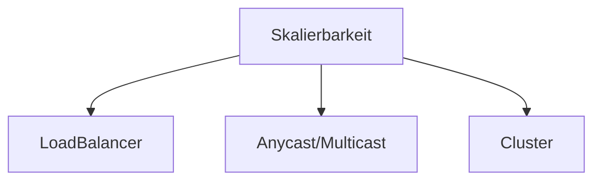

# Skalierbarkeit

## [**Horizontale Skalierung** (scale out) vs **Vertikale Skalierung (scale up)**](https://de.wikipedia.org/wiki/Skalierbarkeit#Vertikale_vs._horizontale_Skalierung:~:text=%5B3%5D-,Vertikale%20Skalierung%20(scale%20up),-%5BBearbeiten%20%7C)

## Beispiele für Umsetzung von horizontaler Skalierungslösungen

## Einschränkung durch Kommunikation+SharedMemory

