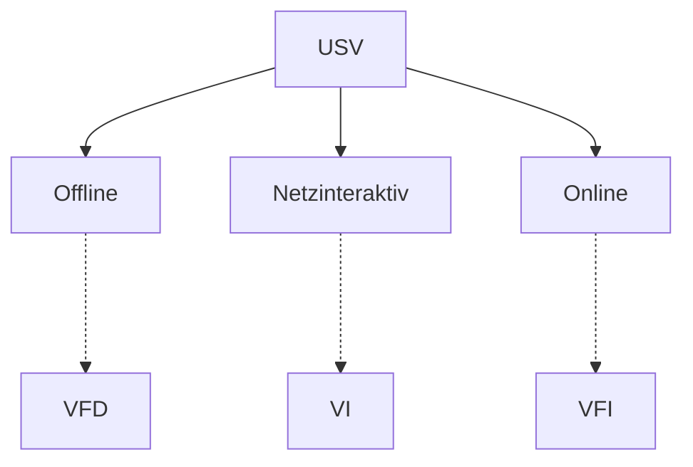

# USV

> 2023 Sommer SI Konzeption — Aufgabe 2

> „Prüfungsvorbereitung Fachinformatiker Systemintegration“ 2.5.7. (Seite 71)

#### [Klassifizierung](https://de.wikipedia.org/wiki/Unterbrechungsfreie_Stromversorgung#Klassifizierung)

