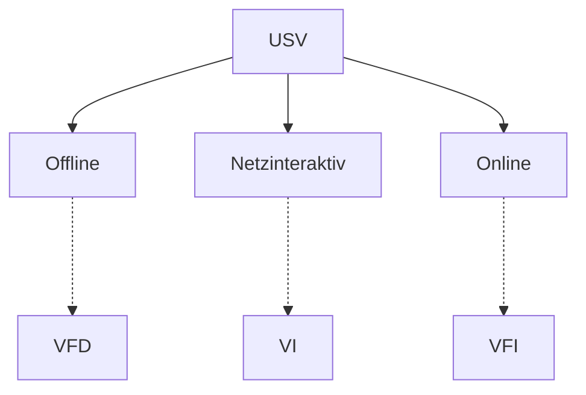

# USV
**U**nterbrechungsfreie **S**trom**v**ersorgung

<!-- toc -->

> **💬❗** Welche Arten von USV kennen Sie? Wie unterscheiden diese sich?
>
> Welche Vor- und Nachteile *(jeweils mindestens 2)* haben sie im Vergleich?

> **📝❗** FiSi AP2 Konzeption Sommer 2023 Aufgabe 2

> „Prüfungsvorbereitung Fachinformatiker Systemintegration“ 2.5.7. (Seite 71)

## [Klassifizierung](https://de.wikipedia.org/wiki/Unterbrechungsfreie_Stromversorgung#Klassifizierung)

### Offline-USV (VFD)
=> **V**oltage and **F**requency **D**ependent

### Netzinteraktive-USV (VI)
=> **V**oltage **I**ndependent (but frequency dependent)

### Online-USV (VFI)
=> **V**oltage and **F**requency **I**ndependent

## Vergleich

|                           | Offline | Netzinteraktiv | Online |
| ------------------------- | ------- | -------------- | ------ |
|                           | VFD     | VI             | VFI    |
| Umschaltzeit              | ~10ms   | ~2-4ms         | 0ms    | 
| Eigenbedarf (Leerlauf)    | ~5W     | ~15W           | ~85W   |
| Wirkungsgrad (unter Last) | ~100%   |                | ~95%   |
| Kosten                    | min     |                | max    |
