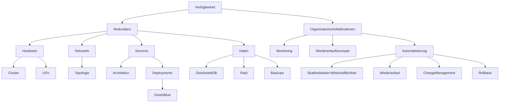
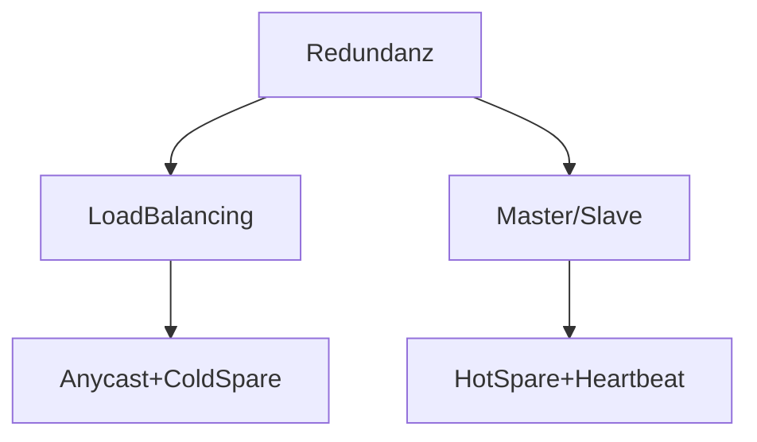
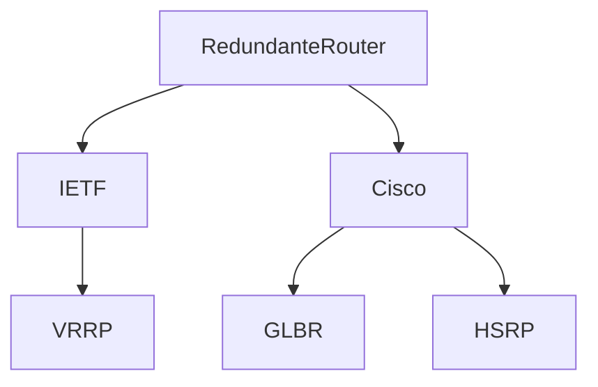

# Verfügbarkeit == Ausfallsicherheit

## Redundanz

### [USV](./usv.md)

### [RAID](./raid.md)

### Redundanz in Netzwerken

#### Redundanz von Services

z.B.
* DNS
* DHCP
* Datenbanken
* Webserver
* Router

#### Redundante Router: first hop redundancy protocols

> „Prüfungsvorbereitung Fachinformatiker Systemintegration“ 2.8.10. (Seite 104)

* verwenden Nachrichten um Status der Router auszutauschen
* verwenden virtuele MAC-Adresse
* verwenden virtuelle IP-Adresse

* erlauben LoadBalancing zwischen Routern (außer HSRP)
