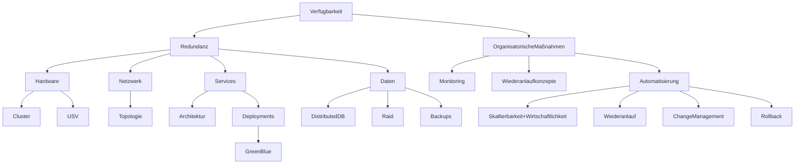
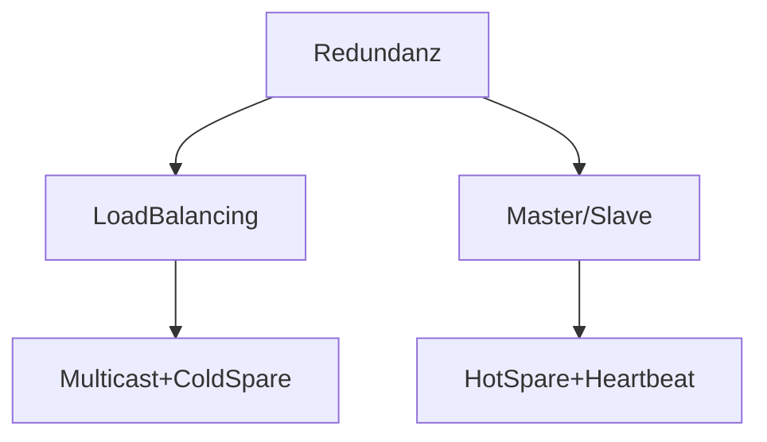
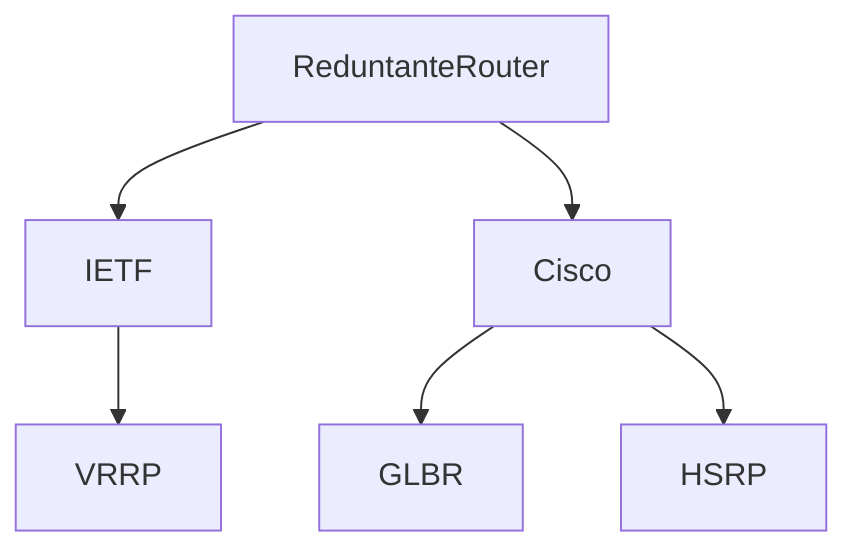
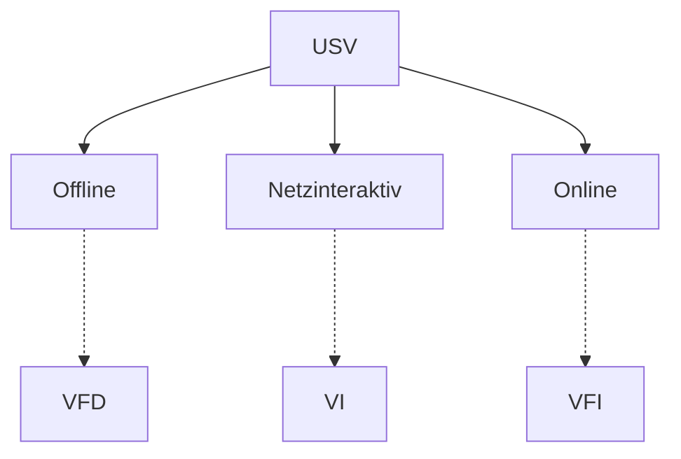

# Verfügbarkeit == Ausfallsicherheit

## Redundanz

### RAID

> Welche **RAID-Level** kennt ihr?

- RAID0 (striping)
- RAID1 (mirroring)
- RAID5 (single parity)
- RAID6 (double parity)

> „Prüfungsvorbereitung Fachinformatiker Systemintegration“ 2.6.4. (Seite 66)

### Redundanz in Netzwerken

#### Redundanz von Services

z.B.
* DNS
* DHCP
* Datenbanken
* Webserver
* Router

> „Prüfungsvorbereitung Fachinformatiker Systemintegration“ 2.8.10. (Seite 104)

#### Redundante Router: first hop redundancy protocols

* verwenden Nachrichten um Status der Router auszutauschen
* verwenden virtuele MAC-Adresse
* verwenden virtuelle IP-Adresse

* erlauben LoadBalancing zwischen Routern (außer HSRP)

### USV

> 2023 Sommer SI Konzeption — Aufgabe 2

> „Prüfungsvorbereitung Fachinformatiker Systemintegration“ 2.5.7. (Seite 71)

