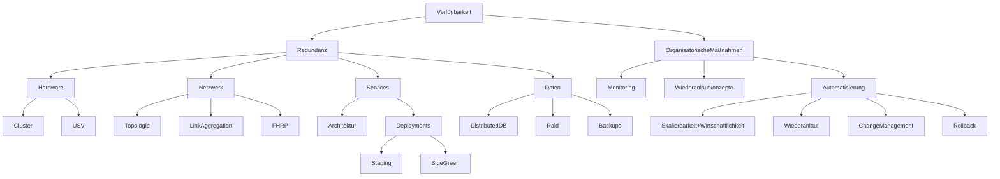
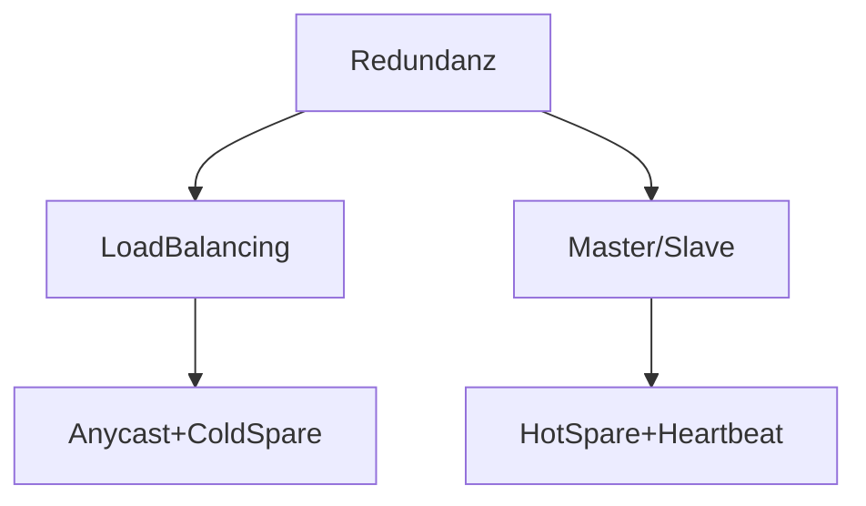

# Verfügbarkeit == Ausfallsicherheit

<!-- toc -->

## => Redundanz

### [USV](./usv.md)

### [RAID](./raid.md)

### [Netzwerk](./netzwerk.md)

### Redundanz von Services

> **💬❗** Welche Maßnahmen zur Erhöhung der Verfügbarkeit kennen Sie?
>
> Welchen Beitrag können diese Maßnahmen zur Skalierbarkeit leisten?

z.B.
* DNS
* DHCP
* Datenbanken
* Webserver
* Router

#### [Link Aggregation](https://de.wikipedia.org/wiki/Link_Aggregation)
IEEE 802.3ad, IEEE 802.1AX

„Bonding“

=> Redundanz => Ausfallsicherheit

=> erhöhter Durchsatz

Verschiedene Funktionen von Link Aggregation:  
[Wikipedia](https://en.wikipedia.org/wiki/Link_aggregation#Linux_drivers)
- Round Robin
- Active Backup
- XOR....

#### [**F**irst **H**op **R**edundancy **P**rotocols (FHRP)](https://en.wikipedia.org/wiki/First-hop_redundancy_protocol)

### Deployments

#### [Staging-Umgebung](https://de.wikipedia.org/wiki/Bereitstellungsumgebung)

> **💬❗** Welche [Bereitstellungsumgebungen](https://de.wikipedia.org/wiki/Bereitstellungsumgebung) kennen Sie?

#### [Blue Green Deployments](https://en.wikipedia.org/wiki/Blue%E2%80%93green_deployment)

> **❓❗** Was versteht man unter einem [Blue Green Deployment](https://en.wikipedia.org/wiki/Blue%E2%80%93green_deployment)?

## TOM

> **💬❗** Welche Technischen und **Organisatorischen** Maßnahmen sind erforderlich um Verfügbarkeit für ein System zu gewährleisten?
