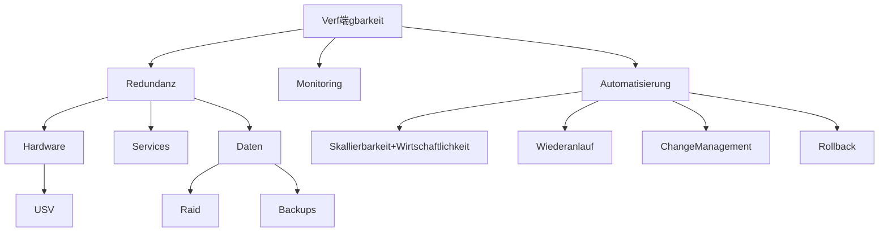

# Verf端gbarkeit

```mermaid
flowchart TB
  Verf端gbarkeit --> Redundanz
  Redundanz --> Hardware
  Redundanz --> Services
  Hardware --> USV
  Redundanz --> Daten
  Daten --> Raid
  Daten --> Backups
  Verf端gbarkeit --> Monitoring
  Verf端gbarkeit --> Automatisierung
  Automatisierung --> Skallierbarkeit+Wirtschaftlichkeit
  Skallierbarkeit+Wirtschaftlichkeit
  Automatisierung --> Wiederanlauf
  Automatisierung --> ChangeManagement
  Automatisierung --> Rollback
```
