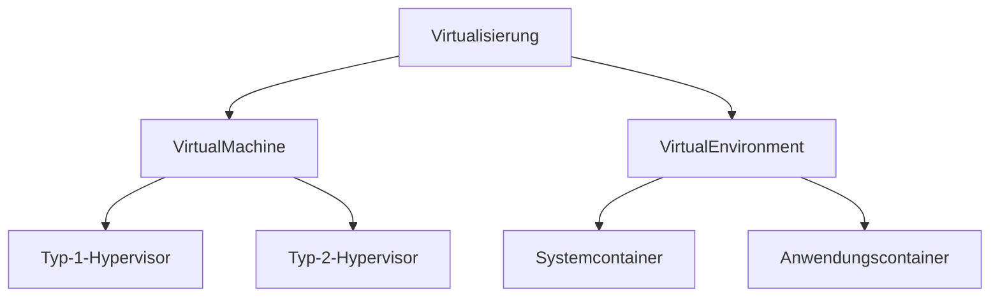

# [Virtualisierung](https://de.wikipedia.org/wiki/Virtualisierung_(Informatik))

> **📝❗** FiSi AP2 Analyse Winter 2023 Aufgabe 1b

Virtualisierung erlaubt mehrere Systeme auf des selben physischen Host-Hardware gleichzeitig auszuführen. Aus Sicht des Gast-Systeme verhält sich die virtualisierte Umgebung gleich oder zumindest ähnlich wie die physische Hardware.

[**Virtuelle Maschinen** (VMs)](https://de.wikipedia.org/wiki/Virtuelle_Maschine) basieren auf der Virtualisierung (Multiplexing) jeder einzelnen Hardwarekomponente (Prozessorvirtualisierung, Speichervirtualisierung, Netzwerkvirtualisierung, …).

Die Implementierung kann jeweils als **Emulation** in Software (flexibel aber ineffizient), in Hardware oder einer Kombination von beidem erfolgen.
Moderne Prozessoren verfügen über geeignete Erweiterungen um Virtualisierung in Hardware effizient zu unterstützen. Die Kontrolle erfolgt üblicherweise in Software durch den sogenannten 
[**Hypervisor**](https://de.wikipedia.org/wiki/Hypervisor) (auch **Virtual-Machine-Monitor** genannt), welcher das Betriebssystems des Hosts ergänzt (Typ-2) oder ersetzt (Typ-1).

Für viele Anwendungsfälle ist eine Isolation von Systemen erwünscht, jedoch keine Virtualisierung von vollständigen Maschinen notwendig.Für diesen Fall können leichtgewichtige **Virtual Environments** (VE) verwendet werden, deren Funktionalität direkt vom Betriebssystem ohne zusätzlichen Hypervisor bereitgestellt wird. Historisch sind [Jails](https://en.wikipedia.org/wiki/FreeBSD_jail) wichtig. Heute sind Container nach dem [**OCI-Standart**](https://de.wikipedia.org/wiki/Open_Container_Initiative), insbesondere [**Docker**](https://de.wikipedia.org/wiki/Docker_(Software)) sehr verbreitet.

|           | Typ-1-Hypervisor | Typ-2-Hypervisor | Systemcontainer | Anwendungscontainer |
| --------- | ---------------- | ---------------- | --------------- | ------------------- |
| Hypervisor | (native/bare-metal: Hypervisor ersetzt/ist Host-Kernel) | (hosted: Hypervisor läuft auf dem Host-OS) | Teil der Host-OS-Funktionalität | Host-OS + Container-Dienst |
| Gast      | Als Gast-Betriebssystem muss ein speziell angepasster Kernel verwendet werden, der vom Hypervisor weiß und diesen nutzt. | **Beliebiges OS** kann als Gast verwendet werden. Aus Sicht des Gast-Kernels sieht die VM wie Hardware aus. | Linux-Distribution in [chroot-Umgebung](https://de.wikipedia.org/wiki/Chroot) auf Host-Kernel (Ohne Gast-Kernel) | einzelne isolierte Anwendung |
| |  |  | | |
| Eigenes Init-System | Ja     | Ja               | Ja              | Nein                |   
| Isolation | ++               | +++              | +               | +                   |
| Performance | ++             | +                | +++             | +++                 |
| Leichtgewichtig | +          | +                | ++              | +++                 |   
| Beispiel  | [XEN](https://de.wikipedia.org/wiki/Xen), [Hyper-V](https://de.wikipedia.org/wiki/Hyper-V) | [KVM](https://de.wikipedia.org/wiki/Kernel-based_Virtual_Machine), [VirtualBox](https://de.wikipedia.org/wiki/VirtualBox) | [LXC](https://de.wikipedia.org/wiki/LXC), [FreeBSDjail](https://en.wikipedia.org/wiki/FreeBSD_jail) | [Docker](https://de.wikipedia.org/wiki/Docker_(Software)), [Podman](https://en.wikipedia.org/wiki/Podman) |
| Einsatzgebiete | **dedizierter Virtualisierung**sserver | **VMs auf bestehendem OS** ermöglichen | **leichtgewichtige** VEs für viele **parallele Linux-Systeme** | leichtgewichtige VEs für **isolierte Anwendungen** |

> **📝❗** FiSi AP2 Analyse Sommer 2022 Aufgabe 4
