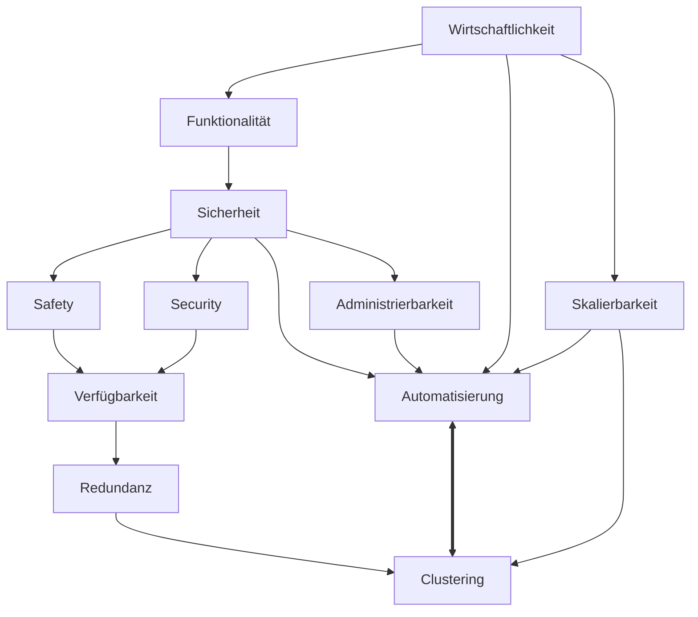

# Wirtschaftlichkeit

> [`Wirtschaftlichkeit`](https://de.wikipedia.org/wiki/Wirtschaftlichkeit#Betriebswirtschaftliche_Kennzahlen_der_Wirtschaftlichkeit) = `Erträge` / `Aufwendungen`

`Erträge` werden durch das bereitstellen von `Funktionalität` erwirtschaftet.

**`Automatisierung`** bietet großes Potential im senken von `Aufwendungen`. Es ermöglichst zuvor `variable Kosten` in nahezu `Fixkosten` zu wandeln. Automatisierungspotential ist in vielen Fällen der Grund Prozesse zu digitalisieren.

Durch **`Skalierbarkeit`** können die [`fixen Stückkosten`](https://de.wikipedia.org/wiki/Fixkostenproportionalisierung#Ermittlung) gesenkt und damit die Wirtschaftlichkeit erhöht werden (`Fixkostendegression`).

Als [Massengut](https://de.wikipedia.org/wiki/Massengut) verkäufliche IT-Produkte können aufgrund von [`Skaleneffekten`](https://de.wikipedia.org/wiki/Skaleneffekt) ([`Economies of scale`](https://en.wikipedia.org/wiki/Economies_of_scale)) besonders effizient von Anbietern erbracht werden, welche sich auf [`Hyperscale computing`](https://en.wikipedia.org/wiki/Hyperscale_computing) spezialisiert haben.

> [Größte Börsenunternehmen nach Marktkapitalisierung](https://de.wikipedia.org/wiki/Liste_der_gr%C3%B6%C3%9Ften_Unternehmen_der_Welt#PwC_Global_Top_100_%E2%80%93_Gr%C3%B6%C3%9Fte_b%C3%B6rsennotierte_Unternehmen_nach_Marktkapitalisierung)

Kleinere Unternehmen und [Startups](https://de.wikipedia.org/wiki/Start-up-Unternehmen) sind eher dann konkurenzfähig, wenn sie individuelle Dienstleistungen entsprechend variabler **`Kundenanforderungen`** anbieten. Dazu zählen Beratung, Support, Integration, Anpassungen, …

Die gute **`Administrierbarkeit`** von Systemen wird durch ein geeignetes Maß an **`Automatiserung`** begünstigt. Beide sind Voraussetzung für Skalierbarkeit und Sicherheit.

**`Sicherheit`** ist eine wichtige Funktionalität, die den Wert eines Produktes mitbestimmt. Sicherheit benötigt Investitionen, lohnt sich aber durch Reduktion von Risiken. **`Schutzbedarfs- und Risikoanalyse`** können bei der Beurteilung helfen, welches Maß an Risikobehandlung [„good enough“](https://en.wikipedia.org/wiki/Principle_of_good_enough) ist.

Sicherheit wird in **`Safety`** (Betriebssicherheit) und **`Security`** (Schutz vor Angreifern) unterschieden. Beide sind von geeigneter Automatisierung abhängig.

**`Verfügbarkeit`** ist ein [Schutzziel (Grundwert)](https://de.wikipedia.org/wiki/Informationssicherheit#Motivation_und_Ziele_der_Informationssicherheit) der IT-Sicherheit. Die technische Maßnahmen zur Erhöhung der Verfügbarkeit basieren meist auf Redundanz.

Um **`Redundanz`** effektiv und wirtschaftich bereit zu stellen, sollten Komponenten möglichst nicht als `Standby`, sondern in einer [**`Aktiv/Aktiv`**](https://de.wikipedia.org/wiki/Aktiv/Aktiv-Cluster)-Konfiguration mit [**`Load Balancing`**](https://de.wikipedia.org/wiki/Lastverteilung_(Informatik)) betrieben werden.

**`Cluster`**-Lösungen zeichnen sich durch einen hohen Automatisierungsgrad aus und sind für die Zwecke [Hochverfügbarkeit](https://de.wikipedia.org/wiki/Rechnerverbund#Hochverf%C3%BCgbarkeitscluster) und [Skalierbarkeit](https://de.wikipedia.org/wiki/Rechnerverbund#Load-Balancing-Cluster) optimiert.
